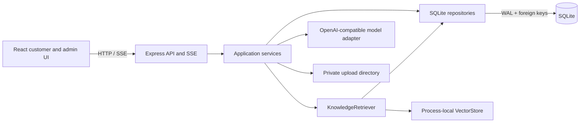
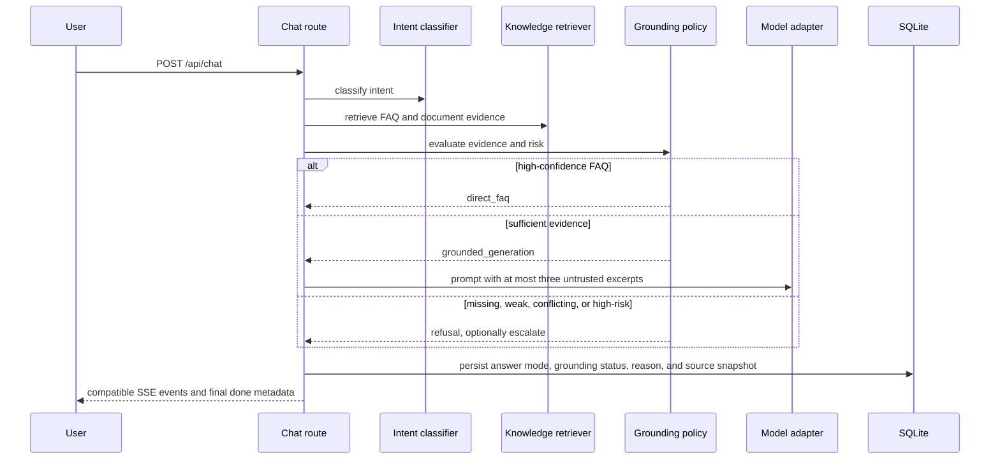

# Architecture

Smart Customer Service AI is a modular monolith for small, self-hosted support
workloads. React and Express are deployed as separate processes, while the API
keeps business workflows, SQLite persistence, retrieval, and model adapters in
one codebase. This is an intentional pre-1.0 tradeoff: the default installation
stays runnable without Redis, a worker service, or a dedicated vector database.

## Runtime Topology

The process-local index is rebuilt from embeddings persisted in SQLite. SQLite
is therefore the durable source of truth; the vector index is a disposable
read model.

## Module Boundaries

| Boundary | Responsibility |
| --- | --- |
| `client/src/api` | HTTP and SSE transport |
| `client/src/hooks` | UI workflow and client state |
| `client/src/components`, `pages` | Reusable rendering and route composition |
| `server/routes` | Input validation, authorization, transport, and response shape |
| `server/services` | Business workflows, transactions, and cross-module coordination |
| `server/db/repos` | SQL and row-to-domain mapping |
| `server/ai` | Model clients, prompts, embeddings, retrieval, and vector-store contracts |

Routes do not own SQL or provider calls. Repositories do not depend on Express.
The model never directly performs database writes or business actions.

## Grounded Chat Flow

The grounding decision is deterministic and runs before generation:

- `direct_faq`: return a high-confidence keyword/hybrid FAQ answer without asking the model to
  rewrite a policy.
- `grounded_generation`: generate only when the top retrieved source clears the
  current retrieval-score rule. The name is an internal answer mode; it does
  not imply claim-level citation alignment or post-generation entailment.
- `refusal`: do not call the answer-generation stream when evidence is missing
  or weak, duplicate direct FAQs conflict, the user explicitly asks for a
  human, or deterministic rules recognize an unsupported business action.

Answer mode, grounding status, reason, and source snapshots are persisted with
the assistant message. The existing SSE event names remain unchanged; new
fields are optional in the final `done` event.

## Knowledge Ingestion And Consistency

FAQ writes and document ingestion update both durable rows and the process
index through application services. Document uploads validate file type,
content, size, and counts before they become retrievable. Parsed documents are
split into chunks; embeddings include title and section metadata and carry a
profile derived from the active provider, model, endpoint, and input schema.

When an embedding profile changes, replacement vectors are generated before an
atomic database update and index swap. A failed rebuild leaves the previous
usable vectors in place. Delete and enable/disable workflows keep SQLite and
the corresponding index namespace aligned.

## Trust And Security Boundaries

- Uploaded and retrieved text is untrusted prompt data. Delimiters are escaped,
  and only a bounded number of excerpts enters the prompt.
- Admin routes require authentication and server-side admin authorization.
- Anonymous conversation history is protected by session ownership checks.
- Provider keys come from environment variables or deployment secrets. Admin
  APIs expose configured status, never key material.
- Upload APIs enforce type and resource limits and do not return storage paths,
  hashes, embeddings, or parser exceptions.
- The model has no business-operation tools. Deterministic rules recognize
  common private order, logistics, account, address, cancellation, and refund
  action requests, then refuse and route them to human support.
- Provider calls have bounded, abortable timeouts. Streaming responses are not
  retried after the first token, preventing duplicated partial answers.

## Availability And Failure Behavior

- `/api/health` is a liveness probe.
- `/api/ready` reports whether startup has completed and changes to not-ready
  during shutdown.
- `SIGINT` and `SIGTERM` stop accepting traffic, close idle connections, close
  SQLite, and use a bounded forced-close fallback.
- Retrieval and model failures return handled SSE errors or deterministic
  fallbacks; incomplete generated answers are not persisted as successful
  assistant messages.
- SQLite uses WAL mode, foreign keys, and a busy timeout. The architecture
  targets one application instance with a small knowledge collection.

## Scaling Triggers

New infrastructure should follow measurements, not portfolio optics:

| Signal | Likely evolution |
| --- | --- |
| Upload parsing or embedding causes visible request latency/timeouts | Move ingestion behind a durable job boundary and idempotent worker |
| Index rebuild time or memory materially affects startup/availability | Add a persistent vector adapter and asynchronous index lifecycle |
| Multiple API replicas are required | Externalize process-local index/config/rate-limit state and define cache invalidation |
| SQLite write contention, backup, or tenant isolation becomes limiting | Introduce explicit migrations and a server database |
| Retrieval quality, not recall latency, is the bottleneck | Run versioned threshold/reranker experiments before changing storage |

The current `VectorStore` interface isolates local vector operations, but a
network vector database would also require asynchronous contracts, health
handling, retry policy, and consistency tests; it is not a drop-in deployment
switch today.

## Known Limits

- One deployment-wide knowledge base; no tenant isolation or fine-grained RBAC.
- Document parsing and embedding remain inside the API request process.
- Scanned PDFs, OCR, image knowledge, web ingestion, and document versioning are
  not implemented.
- Conflict detection is intentionally narrow: it detects duplicate normalized
  direct-FAQ questions with different answers, not arbitrary contradictions
  across prose documents.
- Grounding thresholds are initial deterministic safeguards. v0.2.8 will
  version and evaluate them against mixed-source failure cases.
- Escalation records exist, but real-time agent assignment and response are not
  yet implemented.

See [ROADMAP.md](ROADMAP.md) for the ordered product plan and
[docs/releases/](docs/releases/) for release evidence.
