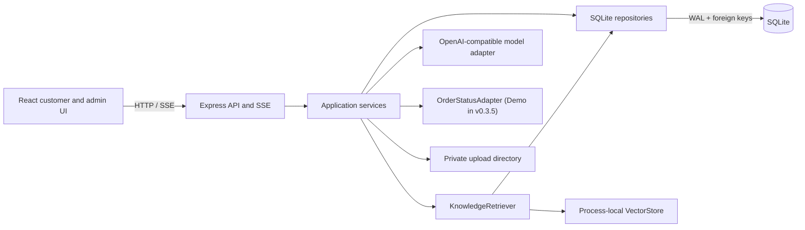
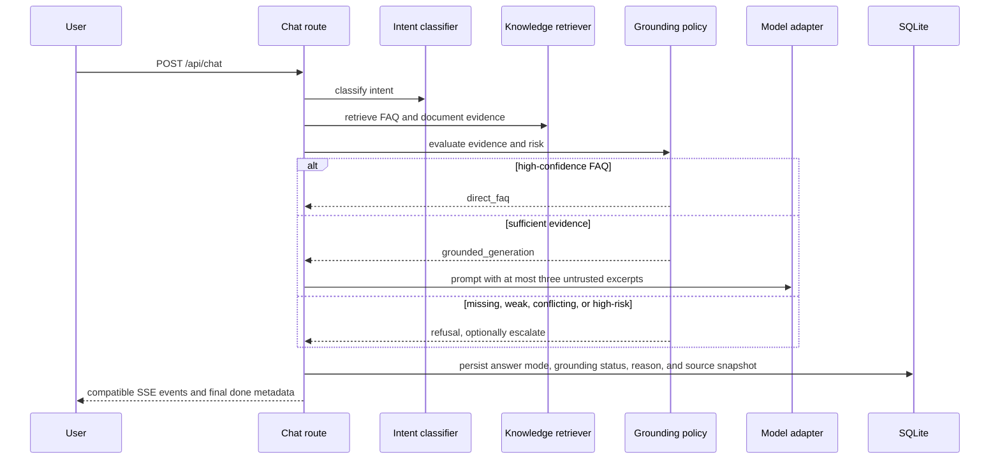
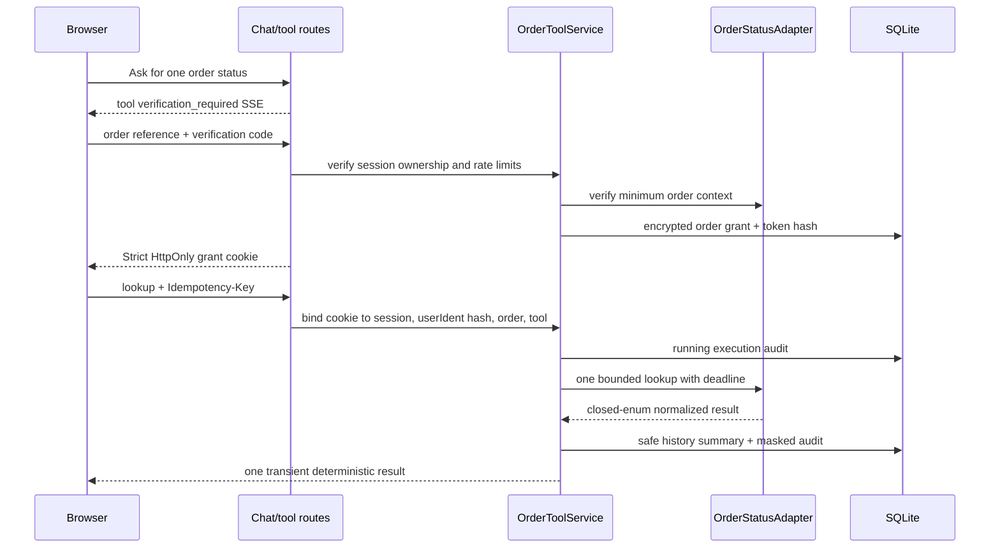

# Architecture

ResolveWeave is a modular monolith for small, self-hosted support
workloads. React and Express are deployed as separate processes, while the API
keeps business workflows, SQLite persistence, retrieval, and model adapters in
one codebase. This is an intentional pre-1.0 tradeoff: the default installation
stays runnable without Redis, a worker service, or a dedicated vector database.

## Runtime Topology


```mermaid
flowchart LR
  Browser["React customer and admin UI"]
  API["Express API and SSE"]
  Services["Application services"]
  Repos["SQLite repositories"]
  Retrieval["KnowledgeRetriever"]
  Index["Process-local VectorStore"]
  Model["OpenAI-compatible model adapter"]
  OrderAdapter["OrderStatusAdapter (Demo in v0.3.5)"]
  Files["Private upload directory"]

  Browser -->|"HTTP / SSE"| API
  API --> Services
  Services --> Repos
  Services --> Retrieval
  Services --> Model
  Services --> OrderAdapter
  Repos -->|"WAL + foreign keys"| SQLite[(SQLite)]
  Retrieval --> Repos
  Retrieval --> Index
  Services --> Files
```

The process-local index is rebuilt from embeddings persisted in SQLite. SQLite
is therefore the durable source of truth; the vector index is a disposable
read model.

## Module Boundaries

| Boundary | Responsibility |
| --- | --- |
| `client/src/api` | HTTP and SSE transport |
| `client/src/hooks` | UI workflow and client state |
| `client/src/components`, `pages` | Reusable rendering and route composition |
| `server/routes` | Input validation, authorization, transport, and response shape |
| `server/services` | Business workflows, transactions, and cross-module coordination |
| `server/db/repos` | SQL and row-to-domain mapping |
| `server/ai` | Model clients, prompts, embeddings, retrieval, and vector-store contracts |
| `server/tools` | Deterministic tool routing, normalized tool contracts, and replaceable adapters |

Routes do not own SQL or provider calls. Repositories do not depend on Express.
The model never directly performs database writes or business actions.

## First-Value And Installation State

SQLite records whether an installation is `fresh` or `legacy`, the current
onboarding state, and idempotent sample-pack installation attempts. Existing
databases are classified as legacy during the additive migration and are never
forced into the guide. Fresh installations may dismiss or resume the guide.

`sample-pack-v1` is installed only through an explicit admin action. Stable
sample keys, one installation row, a transaction boundary, and retryable
failure state prevent duplicate FAQ or document records across request replay,
concurrent calls, or a failed document-processing attempt. `db:seed` has the
smaller responsibility of synchronizing the deployment-managed administrator;
it does not create knowledge.

Guided chat uses the existing `POST /api/chat` surface with one optional
`onboardingRunId`. Its SSE event names and ordinary-client behavior remain
unchanged. Onboarding sessions are identified by `sessions.origin` and an
optional run id, and are excluded in SQL from ordinary session, satisfaction,
and escalation metrics. The server records first value only after the
assistant message has sufficient grounding and a source from the installed
sample document; client-supplied session or message ids are not trusted.

## Unified Operations Read Model

`GET /api/admin/operations/overview` composes a bounded, read-only operational
snapshot from SQLite, deployment configuration, and the existing vector-store
status boundary. It distinguishes healthy local deterministic operation from
optional OCR or Qdrant that is not configured. Model status means
configuration readiness only: the overview does not call an LLM provider or
create hidden usage.

The unified page deliberately exposes only low-risk recovery. Failed documents
reuse the document workbench retry contract, and failed quality runs create a
new idempotent run with the original dataset versions, policy grid, backend
targets, and active-policy snapshot. Index build, activation, rollback, and OCR
review remain in their owner workbenches, where existing confirmations and
invariants stay visible.

## Grounded Chat Flow


```mermaid
sequenceDiagram
  participant U as User
  participant R as Chat route
  participant I as Intent classifier
  participant K as Knowledge retriever
  participant G as Grounding policy
  participant M as Model adapter
  participant D as SQLite

  U->>R: POST /api/chat
  R->>I: classify intent
  R->>K: retrieve FAQ and document evidence
  R->>G: evaluate evidence and risk
  alt high-confidence FAQ
    G-->>R: direct_faq
  else sufficient evidence
    G-->>R: grounded_generation
    R->>M: prompt with at most three untrusted excerpts
  else missing, weak, conflicting, or high-risk
    G-->>R: refusal, optionally escalate
  end
  R->>D: persist answer mode, grounding status, reason, and source snapshot
  R-->>U: compatible SSE events and final done metadata
```

The grounding decision is deterministic and runs before generation:

- `direct_faq`: return a high-confidence keyword/hybrid FAQ answer without asking the model to
  rewrite a policy.
- `grounded_generation`: generate only when the top retrieved source clears the
  current retrieval-score rule. The name is an internal answer mode; it does
  not imply claim-level citation alignment or post-generation entailment.
- `refusal`: do not call the answer-generation stream when evidence is missing
  or weak, duplicate direct FAQs conflict, the user explicitly asks for a
  human, or deterministic rules recognize an unsupported business action.

Answer mode, grounding status, reason, and source snapshots are persisted with
the assistant message. The existing SSE event names remain unchanged; new
fields are optional in the final `done` event.

## Read-Only Order Tool Flow

`order_status_lookup@1` is the only business tool in v0.3.5. A deterministic
pre-RAG router applies this precedence: explicit human request, unsupported
write action, private order lookup, policy question. Policy questions still use
the knowledge path; refunds, cancellation, returns, and address changes never
call the adapter.


```mermaid
sequenceDiagram
  participant B as Browser
  participant R as Chat/tool routes
  participant S as OrderToolService
  participant A as OrderStatusAdapter
  participant D as SQLite

  B->>R: Ask for one order status
  R-->>B: tool verification_required SSE
  B->>R: order reference + verification code
  R->>S: verify session ownership and rate limits
  S->>A: verify minimum order context
  S->>D: encrypted order grant + token hash
  R-->>B: Strict HttpOnly grant cookie
  B->>R: lookup + Idempotency-Key
  R->>S: bind cookie to session, userIdent hash, order, tool
  S->>D: running execution audit
  S->>A: one bounded lookup with deadline
  A-->>S: closed-enum normalized result
  S->>D: safe history summary + masked audit
  S-->>B: one transient deterministic result
```

The browser may render the cropped structured result only on the current page.
SQLite stores neither that result nor a replayable token: grants contain an
encrypted order reference, a token hash, HMAC fingerprints, binding metadata,
and expiry; execution audit contains a mask, closed status, adapter/version,
duration, and safe error code. Verification codes and raw provider responses
are never persisted. Startup interrupts orphaned executions and removes expired
grants. Untrusted adapter output is suppressed and creates an `order_support`
handoff; timeout or unavailability offers retry or voluntary handoff without
automatic escalation.

## Knowledge Ingestion And Consistency

FAQ writes and document ingestion update both durable rows and the process
index through application services. Text document uploads run synchronously
through the fixed, versioned pipeline:

```text
validate → parse → normalize → clean → quality_gate → chunk → embed → publish
```

TXT, Markdown, text-layer PDF, and DOCX adapters produce `DocumentIR v1`
instead of writing chunks directly. Ordered Blocks preserve structure and
provenance; deterministic cleaning and a separate quality decision prevent
review-required or rejected content from entering retrieval. Structured
representations, safe Block payloads, processing tasks, and per-stage counts
are stored additively in SQLite. The original uploaded file remains source
truth and its binary content is not duplicated in the representation tables.

PNG, JPEG, WebP, and scan-only PDF sources take a separate reviewed OCR path:

```text
validate/store → queue authoritative Paddle job → extract → immutable result
  → revisioned review draft → validate/clean/quality/chunk/embed → atomic publish
                     └→ optional DeepSeek shadow job → comparison only
```

Extraction jobs, retry relationships, engine versions, safe errors, timestamps,
and immutable results are additive SQLite records. A single-process scheduler
recovers interrupted `running` jobs to `queued`, claims one job transactionally,
and executes through the project-owned HTTP contract. PaddleOCR PP-StructureV3
is authoritative; optional DeepSeek-OCR-2 output is stored separately and
cannot create or overwrite the review draft.

Chunks retain source Block ids, heading path, page range, representation
version, chunker version, extraction job, and OCR engine/version. Embeddings include title and section metadata and
carry a profile derived from the active provider, model, endpoint, and input
schema, while user-visible excerpts preserve source text.

When an embedding profile changes, replacement vectors are generated before an
atomic database update and index swap. A failed rebuild leaves the previous
usable vectors in place. Explicit reprocessing of a published legacy document
uses a shadow representation/chunk build and replaces live chunks only after
all pre-publication stages succeed. A publication failure restores the previous
database state and rebuilds the in-memory index; if convergence cannot be
confirmed, the document is disabled with an index-failure state. Delete and
enable/disable workflows keep SQLite and the corresponding index namespace
aligned.

## Trust And Security Boundaries

- Uploaded and retrieved text is untrusted prompt data. Delimiters are escaped,
  and only a bounded number of excerpts enters the prompt.
- Admin routes require authentication and server-side admin authorization.
- Anonymous conversation history is protected by session ownership checks.
- Provider keys come from environment variables or deployment secrets. Admin
  APIs expose configured status, never key material.
- Upload APIs enforce type and resource limits and do not return storage paths,
  hashes, embeddings, or parser exceptions.
- OCR sources are checked against extension, MIME type, binary signature,
  request size, and SHA-256 at both the API and worker boundaries. Worker
  responses are schema-validated and bounded before persistence.
- OCR output remains untrusted and non-searchable until an administrator
  publishes the complete validated draft. Shadow output has no publication
  authority.
- The model cannot invoke business operations. The one read-only order tool is
  selected by deterministic rules, and the adapter receives no conversation,
  prompt, admin credential, or write authority.
- Order grants are random Strict HttpOnly cookies whose hashes are bound to one
  active customer session, `userIdent` fingerprint, order fingerprint, and
  tool version. New verification revokes the old session grant.
- Provider calls have bounded, abortable timeouts. Streaming responses are not
  retried after the first token, preventing duplicated partial answers.
- JSON and SSE mutation clients may send an `Idempotency-Key`. The API stores
  the request fingerprint and completed response in SQLite after authorization;
  matching retries replay that response, while payload reuse and in-flight
  duplicates fail closed with `409`.
- Order lookup deliberately bypasses generic response replay. Its required key
  is recorded only on the masked tool execution, and same-key retries fail
  closed with `409`, so the transient structured order result is never written
  to `idempotency_records`.

## Availability And Failure Behavior

- `/api/health` is a liveness probe.
- `/api/ready` reports whether startup has completed and changes to not-ready
  during shutdown.
- `SIGINT` and `SIGTERM` stop accepting traffic, close idle connections, close
  SQLite, and use a bounded forced-close fallback.
- Retrieval and model failures return handled SSE errors or deterministic
  fallbacks; incomplete generated answers are not persisted as successful
  assistant messages.
- Idempotency records survive normal process restarts and expire after 24
  hours. A connection closed before a response is finalized leaves an
  ambiguous request in `processing`, so same-key retries fail closed instead
  of risking a duplicate write. Multipart uploads use their existing
  content/workflow duplicate checks instead of generic response replay.
- SQLite uses WAL mode, foreign keys, and a busy timeout. The architecture
  targets one application instance with a small knowledge collection.

## Scaling Triggers

New infrastructure should follow measurements, not portfolio optics:

| Signal | Likely evolution |
| --- | --- |
| Text parsing or embedding causes visible request latency/timeouts | Extend the proven OCR job boundary to other fixed ingestion stages |
| OCR throughput or multiple replicas exceed single-process polling | Introduce a distributed claim/lease queue without changing the extraction contract |
| Index rebuild time or memory materially affects startup/availability | Add a persistent vector adapter and asynchronous index lifecycle |
| Multiple API replicas are required | Externalize process-local index/config/rate-limit state and define cache invalidation |
| SQLite write contention, backup, or tenant isolation becomes limiting | Introduce explicit migrations and a server database |
| Retrieval quality, not recall latency, is the bottleneck | Run versioned threshold/reranker experiments before changing storage |

The current `VectorStore` interface isolates local vector operations, but a
network vector database would also require asynchronous contracts, health
handling, retry policy, and consistency tests; it is not a drop-in deployment
switch today.

## Known Limits

- One deployment-wide knowledge base; no tenant isolation or fine-grained RBAC.
- Text-document parsing and embedding remain inside the API request process.
- OCR scheduling is durable but deployment-local: one application process polls
  SQLite, and there is no distributed lease coordination across replicas.
- PNG/JPEG/WebP and scan-only PDFs can be reviewed through OCR. Image-only DOCX,
  free-form VLM extraction, multimodal embeddings, web ingestion, and
  source-file version history are not implemented.
- The local Paddle worker has a heavy first-start model download and should be
  isolated on a trusted private network.
- Conflict detection is intentionally narrow: it detects duplicate normalized
  direct-FAQ questions with different answers, not arbitrary contradictions
  across prose documents.
- Grounding thresholds remain deterministic safeguards governed by the
  versioned Quality Lab.
- Escalation records exist, but real-time agent assignment and response are not
  yet implemented.
- Order lookup uses fictional Demo fixtures unless a future adapter is supplied.
  It provides no persistent customer identity, order history, notifications,
  polling, refunds, cancellation, returns, address changes, or other writes.
- Idempotency is deployment-local and does not coordinate independent API
  replicas or external business systems.

See [ROADMAP.md](ROADMAP.md) for the ordered product plan and
[docs/releases/](docs/releases/) for release evidence.
