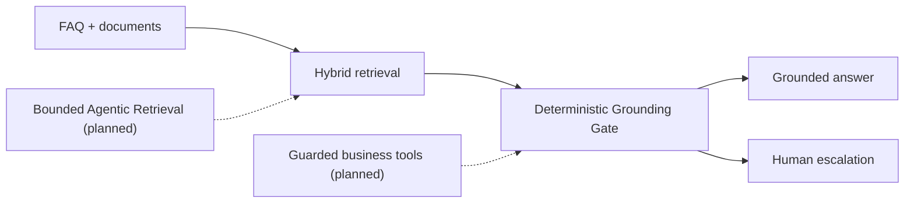

# ResolveWeave

> Evidence-first open-source enterprise customer service: grounded answers,
> document RAG, quality evaluation, and structured human escalation in one
> runnable full-stack project.

[](LICENSE)
[](https://nodejs.org/)
[](https://tdesign.tencent.com/react/overview)
[](https://www.sqlite.org/)
[](https://platform.openai.com/docs/api-reference)
[](Dockerfile)
[](https://github.com/Rcloudso/smart-customer-service-ai/actions/workflows/ci.yml)
[](https://github.com/Rcloudso/smart-customer-service-ai/stargazers)

**Chinese version**: [README_CN.md](README_CN.md)

Current version: **v0.2.9 (pre-1.0)**. APIs and persisted data remain subject to change before 1.0.

<p align="center">
  <a href="https://github.com/Rcloudso/smart-customer-service-ai/releases/download/v0.2.6/smart-customer-service-v0.2.6-demo.mp4">
    
  </a>
</p>

<p align="center">
  <a href="https://github.com/Rcloudso/smart-customer-service-ai/releases/download/v0.2.6/smart-customer-service-v0.2.6-demo.mp4">Watch the document RAG demo (v0.2.6)</a>
  · <a href="docs/case-studies/ai-assisted-development-v0.2.6.md">AI-assisted development case study</a>
  · <a href="docs/releases/v0.2.9-evidence.md">v0.2.9 release evidence</a>
</p>

## English

ResolveWeave is a pre-1.0 enterprise customer service platform for building
support that can explain why it answered, refuse when evidence is weak, and
hand risky cases to people with useful context.

The current release combines customer chat, FAQ and document knowledge,
hybrid retrieval, persisted sources, deterministic Grounding decisions,
structured escalation, an operations console, and repeatable quality
evaluation. It starts without a paid model key and is evolving toward a
bounded Agentic Retrieval architecture without giving the model authority over
answer release or business actions.

[Quick Start](#quick-start) · [Why This Project](#why-this-project) · [Features](#features) · [Architecture](ARCHITECTURE.md) · [Evaluation](#evaluation-and-debugging) · [Roadmap](ROADMAP.md)

If this direction is useful to you, consider
[starring the repository](https://github.com/Rcloudso/smart-customer-service-ai)
to follow the enterprise customer-service roadmap.

---

## What It Does

Type a customer question, and the system runs a support flow:

```text
User: How can I request a refund?

ResolveWeave:
  Step 1: classify the question intent
  Step 2: retrieve related FAQ entries and document chunks with hybrid search
  Step 3: decide whether evidence supports a direct answer, generation, or refusal
  Step 4: answer with persisted sources, or escalate high-risk/conflicting requests
```

Admins can maintain FAQs, upload and manage documents, preview indexed chunks, inspect retrieval behavior, review conversations, and turn weak answers into reusable FAQs from the Knowledge Review page.

The current release is suitable for learning, evaluation, demonstrations and
small pre-production pilots. It deliberately keeps SQLite and an in-memory
vector index as the no-infrastructure path while documenting the controls
still required for serious production deployment.

### Product evidence

| Escalation triage queue | Structured handoff packet | Mobile dark theme |
| --- | --- | --- |
|  |  |  |

---

## Why This Project

Many RAG demos stop at “retrieve text and call an LLM.” This project treats
trust, operations and verification as product features:

The name **ResolveWeave** reflects the product direction: weave trusted
knowledge, bounded model reasoning, guarded business tools and human judgment
into one accountable customer-resolution flow.

- **Evidence before generation** — deterministic policy chooses FAQ direct
  answer, grounded generation, refusal or escalation before releasing a reply.
- **A knowledge operations loop** — weak answers and negative feedback become
  review items that can be turned into reusable knowledge.
- **Human escalation with context** — risky or conflicting cases carry facts,
  missing information, sources, priority and a recommended queue.
- **Evaluation-driven changes** — retrieval and Grounding policies are compared
  against versioned cases before they are published.
- **Runnable without a paid model key** — the local deterministic path keeps a
  fresh clone useful before external AI infrastructure is configured.
- **A focused enterprise path** — structure-aware ingestion, OCR, Qdrant and
  bounded Agentic Retrieval are planned as separately testable releases rather
  than one framework rewrite.

| Available now — v0.2.9 | Next — v0.3.x |
| --- | --- |
| FAQ and document RAG, hybrid retrieval, persisted sources, Quality Lab, structured escalation, bilingual UI, Docker and CI | Structure-aware ingestion, OCR/table/image knowledge, optional Qdrant, retrieval traces, bounded Agentic Retrieval, then mock-first business tools |

See [ROADMAP.md](ROADMAP.md) for release boundaries and non-goals.



---

## Features

- **Customer chat experience** - streaming-style support UI with safe Markdown rendering, conversation context, compact document references, feedback, and history.
- **Answer-evidence policy** - choose deterministic FAQ, retrieval-supported generation, or refusal before answer generation; persist the decision and retrieved sources.
- **Admin console** - FAQ management, conversation list, dashboard analytics, and runtime model configuration.
- **Knowledge gap feedback loop** - no-match, low-score, and negatively rated answers become review items that admins can edit, dismiss, or convert into indexed FAQs.
- **Document RAG foundation** - upload TXT, Markdown, text-layer PDF, and DOCX files; parse, semantically chunk, embed, index, retry, enable/disable, preview, and delete them from the admin console.
- **Hybrid multi-source retrieval** - FAQ and document candidates use per-source vector recall plus field-aware keyword recall, then merge with score-aware reciprocal-rank fusion (RRF), deduplicate, and apply source-aware diversity.
- **Compatible intent classification** - structured intent output negotiates `json_schema`, then `json_object`, then validated plain-text JSON before the deterministic keyword fallback.
- **Open vector-store interface** - `VectorStore` keeps the default deployment simple while leaving room for Qdrant or pgvector later.
- **Richer FAQ embeddings** - FAQ vectors are generated from question, answer, and keywords, not only the question.
- **Index operations** - admin users can inspect indexed entries, active entries, missing embeddings, dimensions, rebuild time, and index errors.
- **Retrieval debugging** - admin panel explains ranked matches, source, similarity, keyword score, vector score, and ranking reason.
- **Retrieval evaluation** - repeatable FAQ and document evals report ranking metrics, score/source distributions, failures, and semantic-v1 versus structure-only comparison.
- **RAG Quality Lab** - admins version evaluation sets, compare deterministic retrieval/Grounding strategies, inspect failures and safely publish or roll back an immutable runtime policy.
- **Structured escalation and triage** - every new handoff persists a traceable packet with deterministic priority, risk flags, recommended queue, cited facts, missing information, and retrieval evidence; admins review it in a bilingual read-only queue.
- **Language switching and bilingual dictionary** - fixed UI copy is read from an editable Chinese/English dictionary instead of being hard-coded across pages.
- **Light/dark themes** - persisted theme preferences for both customer and admin workflows.
- **Open-source readiness** - Docker, docker-compose, GitHub Actions CI, Playwright E2E, and bilingual docs are included.

---

## Retrieval Design

The current retrieval flow is intentionally practical:

```text
Query
  |
  +-- per-source embedding candidates through VectorStore
  |
  +-- field-aware SQL LIKE keyword candidates and deterministic query expansion
  |
  +-- merge by namespaced knowledge id
  |
  +-- score-aware reciprocal-rank fusion (RRF), with source diversity
  |
  +-- return matches with similarity-compatible fields
```

The default generic `VectorStore<KnowledgeIndexItem>` implementation is in-memory. FAQ and document-chunk embeddings are serialized in SQLite, then loaded into the shared process index under `faq:<id>` and `document:<chunkId>` namespaces. Each stored vector carries an embedding profile derived from provider, model, endpoint, and input-schema version; stale profiles are rebuilt atomically before the process index is replaced. This keeps local setup dependency-free while preventing vectors from different model configurations from being silently mixed.

FAQ remains a knowledge-source adapter rather than the permanent RAG boundary. TXT, Markdown, text-layer PDF, and DOCX ingestion use `semantic-v1` chunking. Document embeddings include document and section titles, and catalogue-style GPU questions receive deterministic vocabulary expansion before lexical recall. Chat recalls FAQ and document candidates separately so one source cannot crowd out the other.

v0.2.7 evaluates answer evidence before generation. High-confidence keyword/hybrid FAQ matches remain deterministic; non-direct evidence that clears the initial retrieval threshold can enter the model prompt as at most three untrusted excerpts. Missing or weak evidence is refused without calling the answer-generation stream. Duplicate direct FAQs with materially different answers and recognized private-state/action requests are refused and escalated. The answer mode, threshold result, reason, and compact FAQ/document/chunk/page source snapshots are saved with the assistant message and survive history restoration. These are retrieved sources, not claim-level citation or entailment verification.

JSON and SSE mutation endpoints also accept an optional `Idempotency-Key`
header. Reusing the same key with the same payload replays the persisted
response without repeating the write; a different payload or a concurrent
in-flight request returns `409`. The bundled UI generates a key per write
action and synchronously locks mutation controls against rapid re-entry.
Multipart imports/uploads stay outside generic response replay; document
uploads retain SHA-256 duplicate protection.

`FaqMatch` keeps the existing `similarity` field for compatibility and adds optional debugging fields:

- `source`: `vector`, `keyword`, or `hybrid`
- `keywordScore`
- `vectorScore`
- `fusionScore`, `keywordRank`, and `vectorRank`

---

## Quick Start

Use Node.js 20.16+ or 22.3+.

```bash
npm install
cp .env.example .env
npm run db:init
npm run db:seed
EMBED_PROVIDER=other npm run dev
```

Open:

- Customer chat: http://localhost:5173/
- Admin console: http://localhost:5173/admin

Default local admin account:

```text
Username: admin
Password: admin123
```

Change `ADMIN_PASSWORD` before any production-like deployment. The server blocks the default password when `NODE_ENV=production`.

---

## Docker

```bash
docker compose up --build
```

Docker exposes:

- Frontend: http://localhost:5173/
- Backend health check: http://localhost:3001/api/health

The compose example uses `EMBED_PROVIDER=other`, so the project can start without paid model keys. The deterministic local path supports FAQ and document retrieval; document answers fall back to the highest-ranked source excerpt instead of inventing a summary.

Compose uses the `resolve-weave` project name and builds the local image as
`resolve-weave:local`. Its logical `resolve-weave-data` volume still maps to
the standard legacy physical volume
`smart-customer-service_smart-customer-service-data`, so databases created
before the rename remain available. If the previous checkout used another
Compose project name, set `RESOLVE_WEAVE_DATA_VOLUME` to that existing physical
volume; fresh installations may set it to `resolve-weave-data`.

---

## Configuration

Copy `.env.example` to `.env`, then configure the values you need:

| Variable | Purpose |
| --- | --- |
| `JWT_SECRET` | Token signing secret |
| `ADMIN_USERNAME` / `ADMIN_PASSWORD` | Local admin account |
| `LLM_PROVIDER` / `EMBED_PROVIDER` | `openai`, `openai-compatible`, or `other` |
| `LLM_API_BASE` / `LLM_API_KEY` / `LLM_MODEL` | Chat model endpoint, environment-only credential, and model |
| `EMBED_API_BASE` / `EMBED_API_KEY` / `EMBED_MODEL` | OpenAI-compatible embedding model |
| `DOCUMENT_UPLOAD_DIR` | Private document file directory; defaults to `./data/uploads` |
| `RATE_LIMIT_CHAT` / `RATE_LIMIT_ADMIN` / `RATE_LIMIT_LOGIN` | API rate limits |
| `SESSION_INACTIVITY_MINUTES` | Minutes without activity before an active conversation is closed; defaults to `30` |
| `CONVERSATION_EXPORT_MAX_MESSAGES` | Maximum complete message rows in one synchronous filtered CSV export; defaults to `5000` |

The environment is the source of truth for model configuration. The admin model page reads provider, endpoint, and model name from the environment and atomically writes non-secret edits back to the local `.env` file so they take effect immediately. Legacy `model_configs` rows in SQLite no longer override these values. The `openai` provider always uses `https://api.openai.com/v1`; custom API Base URLs are used only by `openai-compatible` and `other`. The admin API exposes only whether a key is configured and never accepts, returns, or rewrites key material; inject keys through environment variables or deployment secrets. In container or managed deployments where environment variables are externally injected or the filesystem is read-only, update the deployment secret/configuration and redeploy instead.

---

## Evaluation And Debugging

Run the repeatable FAQ retrieval benchmark:

```bash
EMBED_PROVIDER=other npm run eval:faq
EMBED_PROVIDER=other npm run eval:document
EMBED_PROVIDER=other npm run eval:mixed
EMBED_PROVIDER=other npm run eval:quality
npm run eval:triage
```

The reports include FAQ Top1/Top3/no-match metrics, a 12-case document benchmark across TXT, Markdown, PDF, and DOCX, and deterministic triage coverage for bilingual security, complaint, refund, order, technical, explicit-human, knowledge-conflict, private-operation, and prompt-injection cases. The document report compares `semantic-v1` with a structure-only baseline and requires 100% Top3 recall without MRR regression.

Document management is available at **Admin Console → Documents**. Uploads are limited to 10 MB, extracted text to 200,000 characters, semantic units to 2,000, and final chunks to 300. Exact duplicate content is rejected by SHA-256; storage paths, hashes, embeddings, and parser exceptions are not returned by the API.

The FAQ report includes:

- Top1 accuracy
- Top3 recall
- No-match accuracy
- Result source distribution
- Failed cases with expected and actual matches

Admins can also use the FAQ management page to run a live retrieval debug query. The debug response explains what matched, how it ranked, and whether the match came from vector search, keyword fallback, or both.

### Knowledge Review Workflow

1. A completed answer with no FAQ match or a top retrieval score below `0.55` is saved as a pending review item. A 1–2 star rating also creates or updates the item for that exact answer.
2. Open **Admin Console → Knowledge Review** to inspect the question, answer, intent, rating, and the top three retrieval results captured at answer time.
3. Edit the proposed question, answer, category, and keywords, then convert the item to an FAQ. Successful conversion updates the semantic index automatically.
4. Ask the same question again to confirm the new FAQ is retrieved. Items with no reusable value can be dismissed with an optional reason.

Explicit “transfer to human” requests remain in the escalation workflow and are not automatically treated as knowledge gaps.

Satisfaction ratings remain backward compatible: clients may rate an exact assistant reply by `messageId` (optionally verified against `sessionId`), while legacy session-only requests rate the latest assistant reply in that session.

---

## Validation

```bash
EMBED_PROVIDER=other npm test
EMBED_PROVIDER=other npm run eval:faq
EMBED_PROVIDER=other npm run eval:document
EMBED_PROVIDER=other npm run eval:mixed
EMBED_PROVIDER=other npm run eval:quality
npm run eval:triage
PLAYWRIGHT_CHANNEL=chromium npm run test:e2e
EMBED_PROVIDER=other npm run build
```

GitHub Actions runs `npm ci`, regression tests, Playwright E2E, and production build checks on pull requests and pushes to `main`.

---

## Project Layout

```text
client/        React + Vite frontend
server/        Express API, services, AI adapters, SQLite repositories
eval/          FAQ and document retrieval evaluation cases
tests/e2e/     Playwright end-to-end tests
ARCHITECTURE.md Runtime topology, trust boundaries, and scaling triggers
data/          Local SQLite database files
```

---

## Current Limits

- The default vector index is process-local memory and scans FAQ plus document-chunk embeddings, so it is suitable for demos and small knowledge collections.
- Embeddings are stored as JSON in SQLite, not in a dedicated vector database.
- Document parsing is synchronous inside the Express process. Encrypted, damaged, and scanned PDFs fail with a stable failure code; OCR, image knowledge, web ingestion, citation links, and page jumps are not included.
- Document files are global to the deployment; v0.2.9 does not add tenant-separated knowledge bases, external workers, document versioning, or external vector storage.
- `VectorStore` isolates local vector operations, but a network vector database still requires asynchronous contracts, health handling, and consistency tests.
- Conflict detection is deliberately narrow: duplicate normalized direct-FAQ questions with different answers. Grounding thresholds are governed through the versioned Quality Lab rather than changed automatically.
- Intent classification falls back to keyword rules when the LLM call fails.
- Idempotency replay is scoped to one deployment and retained for 24 hours;
  multipart uploads are protected by workflow-specific duplicate checks rather
  than generic response replay.
- Escalation triage is read-only in v0.2.9. It does not add human assignment,
  ownership, notes, resolution actions, live takeover, or business tools.
- Optional LLM extraction has a two-second total budget and may improve only
  summaries, cited facts, and missing-information candidates. Deterministic
  priority, risk, queue, and next-step rules remain authoritative.
- This is a pre-1.0 MVP foundation, not a production support platform. Add observability, stricter auth, backup strategy, and external vector storage before serious production use.

---

## Roadmap

The ordered version plan lives in [ROADMAP.md](ROADMAP.md). The next milestones are:

- v0.3.0: versioned document representation, cleaning/quality gates,
  structure-aware chunking and ingestion observability.
- v0.3.1–v0.3.3: OCR/table/image knowledge, optional Qdrant with retrieval
  traces, then bounded Agentic Retrieval behind a deterministic Grounding Gate.
- v0.3.4–v0.3.8: enterprise knowledge operations, mock-first read-only order
  tools, human collaboration, customer identity/memory and guarded actions.
- v0.4.0: multi-knowledge-base and tenant boundaries, RBAC, audit, migration,
  backup, recovery and production observability.

---

## 中文

ResolveWeave 是一个证据优先的开源企业级智能客服平台，支持可信回答、
文档 RAG、质量评测、结构化转人工和中英文切换，并将沿着可控的企业级
Agentic Retrieval 路线持续演进。完整中文说明请阅读
[README_CN.md](README_CN.md)。
