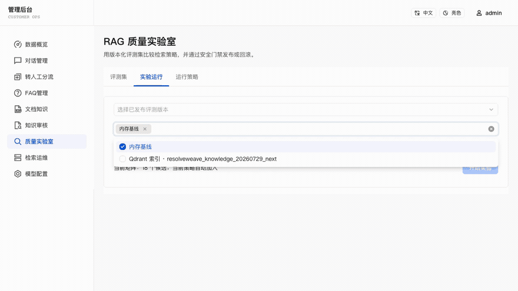
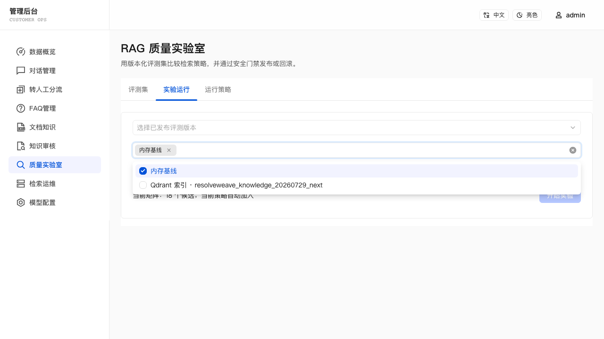
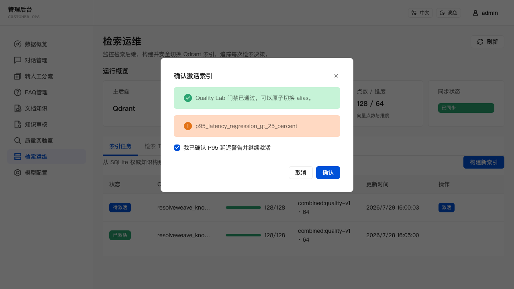
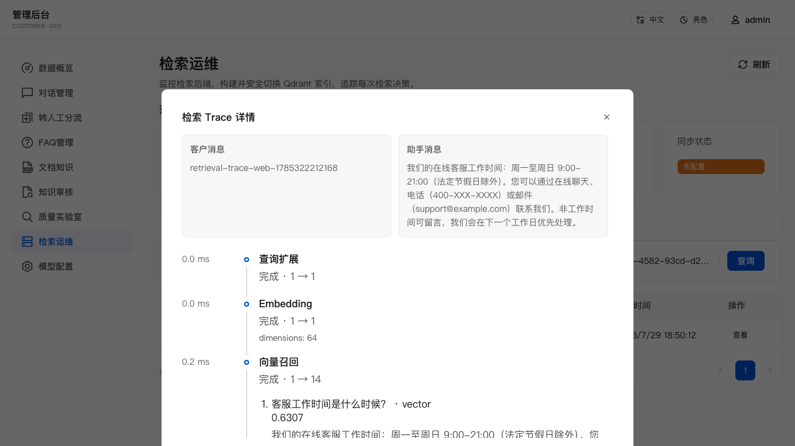
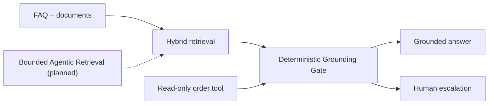

# ResolveWeave

> Evidence-first open-source enterprise customer service: grounded answers,
> document RAG, quality evaluation, and structured human escalation in one
> runnable full-stack project.

[](LICENSE)
[](https://nodejs.org/)
[](https://tdesign.tencent.com/react/overview)
[](https://www.sqlite.org/)
[](https://platform.openai.com/docs/api-reference)
[](Dockerfile)
[](https://github.com/Rcloudso/resolveweave/actions/workflows/ci.yml)
[](https://github.com/Rcloudso/resolveweave/stargazers)

**Chinese version**: [README_CN.md](README_CN.md)

Current version: **v0.3.5 (pre-1.0)**. APIs and persisted data remain subject
to change before 1.0.

[v0.3.5 release notes](docs/releases/v0.3.5.md) ·
[v0.3.5 release evidence](docs/releases/v0.3.5-evidence.md)

<p align="center">
  <a href="https://github.com/Rcloudso/resolveweave/releases/download/v0.3.2/resolveweave-v0.3.2-demo.mp4">
    
  </a>
</p>

<p align="center">
  <a href="https://github.com/Rcloudso/resolveweave/releases/download/v0.3.2/resolveweave-v0.3.2-demo.mp4">Watch the retrieval operations demo (v0.3.2)</a>
  · <a href="docs/releases/v0.3.2.md">v0.3.2 release notes</a>
  · <a href="docs/releases/v0.3.2-evidence.md">v0.3.2 release evidence</a>
</p>

## English

ResolveWeave is a pre-1.0 enterprise customer service platform for building
support that can explain why it answered, refuse when evidence is weak, and
hand risky cases to people with useful context.

The current release combines customer chat, FAQ and document knowledge,
hybrid retrieval, persisted sources, deterministic Grounding decisions,
structured escalation, optional Qdrant, retrieval traces, a unified operations
center, repeatable quality evaluation, and one guarded read-only order-status
tool. A fresh installation can run both its grounded knowledge path and the
Demo order lookup without a paid model key or Qdrant.

[Quick Start](#quick-start) · [Why This Project](#why-this-project) · [Features](#features) · [Architecture](ARCHITECTURE.md) · [Evaluation](#evaluation-and-debugging) · [Roadmap](ROADMAP.md)

If this direction is useful to you, consider
[starring the repository](https://github.com/Rcloudso/resolveweave)
to follow the enterprise customer-service roadmap.

---

## What It Does

Type a customer question, and the system runs a support flow:

```text
User: How can I request a refund?

ResolveWeave:
  Step 1: classify the question intent
  Step 2: retrieve related FAQ entries and document chunks with hybrid search
  Step 3: decide whether evidence supports a direct answer, generation, or refusal
  Step 4: answer with persisted sources, or escalate high-risk/conflicting requests
```

Admins can maintain FAQs, upload and manage documents, preview indexed chunks,
compare memory/Qdrant quality, build and activate Qdrant indexes, inspect
retrieval traces, review conversations, and turn weak answers into reusable
FAQs from the Knowledge Review page.

The current release is suitable for learning, evaluation, demonstrations and
small pre-production pilots. It deliberately keeps SQLite and an in-memory
vector index as the no-infrastructure path while documenting the controls
still required for serious production deployment.

### Product evidence

| Quality backend comparison | Qdrant activation gate | Retrieval trace |
| --- | --- | --- |
|  |  |  |

Earlier engineering case study:
[building the v0.2.6 Document RAG foundation with AI-assisted development](docs/case-studies/ai-assisted-development-v0.2.6.md).

---

## Why This Project

Many RAG demos stop at “retrieve text and call an LLM.” This project treats
trust, operations and verification as product features:

The name **ResolveWeave** reflects the product direction: weave trusted
knowledge, bounded model reasoning, guarded business tools and human judgment
into one accountable customer-resolution flow.

- **Evidence before generation** — deterministic policy chooses FAQ direct
  answer, grounded generation, refusal or escalation before releasing a reply.
- **A knowledge operations loop** — weak answers and negative feedback become
  review items that can be turned into reusable knowledge.
- **Human escalation with context** — risky or conflicting cases carry facts,
  missing information, sources, priority and a recommended queue.
- **Evaluation-driven changes** — retrieval and Grounding policies are compared
  against versioned cases before they are published.
- **Runnable without a paid model key** — the local deterministic path keeps a
  fresh clone useful before external AI infrastructure is configured.
- **A focused enterprise path** — structure-aware ingestion, OCR, Qdrant and
  bounded Agentic Retrieval are planned as separately testable releases rather
  than one framework rewrite.

| Implemented through v0.3.5 | Next |
| --- | --- |
| Verified read-only order lookup, first-value onboarding, unified operations, optional Qdrant, Quality Lab, Retrieval Trace, and reviewed OCR | Add human collaboration before persistent identity or controlled write actions |

See [ROADMAP.md](ROADMAP.md) for release boundaries and non-goals.



---

## Features

- **Customer chat experience** - streaming-style support UI with safe Markdown rendering, conversation context, compact document references, feedback, and history.
- **Read-only order lookup** - verify one Demo order inside the current chat, receive a deterministic status and latest shipping event, and retain only a safe history summary plus masked audit. No refund, cancellation, or address-change execution is available.
- **Answer-evidence policy** - choose deterministic FAQ, retrieval-supported generation, or refusal before answer generation; persist the decision and retrieved sources.
- **Admin console** - FAQ management, conversation list, dashboard analytics, and runtime model configuration.
- **First-value onboarding** - a fresh database routes the first admin login through explicit sample loading, a no-key bilingual document answer, source review, and a clear next step; upgraded installations are not interrupted.
- **Unified operations center** - summarize SQLite, answer mode, embeddings, Qdrant, OCR, bounded task counts, and recent failures without paid-provider probes; retry failed documents or create an idempotent rerun of a failed quality task.
- **Knowledge gap feedback loop** - no-match, low-score, and negatively rated answers become review items that admins can edit, dismiss, or convert into indexed FAQs.
- **Structure-aware document ingestion** - upload TXT, Markdown, text-layer PDF, and DOCX files into a versioned `DocumentIR`; preserve headings, paragraphs, lists, tables, page and block provenance; inspect quality and processing stages; then publish structure-aware chunks atomically.
- **Reviewed OCR ingestion** - route PNG, JPEG, WebP, and scan-only PDF sources to a durable PaddleOCR PP-StructureV3 queue; inspect and edit extracted Blocks before atomic publication, with optional non-authoritative DeepSeek-OCR-2 shadow comparison.
- **Hybrid multi-source retrieval** - FAQ and document candidates use per-source vector recall plus field-aware keyword recall, then merge with score-aware reciprocal-rank fusion (RRF), deduplicate, and apply source-aware diversity.
- **Compatible intent classification** - structured intent output negotiates `json_schema`, then `json_object`, then validated plain-text JSON before the deterministic keyword fallback.
- **Optional Qdrant backend** - the asynchronous `VectorStore` keeps memory as the default and adds Qdrant with stable IDs, safe metadata, health/stats, SQLite hydration, and explicit keyword degradation.
- **Richer FAQ embeddings** - FAQ vectors are generated from question, answer, and keywords, not only the question.
- **Recoverable index operations** - build checkpointed versioned collections from SQLite, validate fingerprint/profile/dimension/count, activate through an atomic alias switch, and roll back without deleting old collections.
- **Retrieval debugging** - admin panel explains ranked matches, source, similarity, keyword score, vector score, and ranking reason.
- **Retrieval evaluation** - repeatable FAQ and document evals report ranking metrics, score/source distributions, failures, and semantic-v1 versus structure-only comparison.
- **RAG Quality Lab** - admins version evaluation sets, compare deterministic retrieval/Grounding strategies across memory and a ready Qdrant job, inspect failures, and safely publish or roll back an immutable runtime policy.
- **Retrieval operations and traces** - a bilingual responsive admin page shows backend health, index jobs, activation gates, and fixed eight-stage traces with safe metadata and bounded candidate lists.
- **Structured escalation and triage** - every new handoff persists a traceable packet with deterministic priority, risk flags, recommended queue, cited facts, missing information, and retrieval evidence; admins review it in a bilingual read-only queue.
- **Language switching and bilingual dictionary** - fixed UI copy is read from an editable Chinese/English dictionary instead of being hard-coded across pages.
- **Light/dark themes** - persisted theme preferences for both customer and admin workflows.
- **Open-source readiness** - Docker, docker-compose, GitHub Actions CI, Playwright E2E, and bilingual docs are included.

---

## Retrieval Design

The current retrieval flow is intentionally practical:

```text
Query
  |
  +-- per-source embedding candidates through VectorStore
  |
  +-- field-aware SQL LIKE keyword candidates and deterministic query expansion
  |
  +-- merge by namespaced knowledge id
  |
  +-- score-aware reciprocal-rank fusion (RRF), with source diversity
  |
  +-- return matches with similarity-compatible fields
```

The asynchronous generic `VectorStore<KnowledgeIndexItem>` defaults to memory.
FAQ and document-chunk embeddings are serialized in SQLite, then loaded into
the shared process index under `faq:<id>` and `document:<chunkId>` namespaces.
Each stored vector carries an embedding profile derived from provider, model,
endpoint, and input-schema version; stale profiles are rebuilt atomically
before the process index is replaced.

When `VECTOR_STORE_PROVIDER=qdrant` is explicitly configured, the application
uses the collection alias from deployment configuration. Qdrant payloads keep
only knowledge identity/version/profile metadata; every vector candidate is
batch-hydrated from SQLite and rejected if the current knowledge is missing,
disabled, stale, or attached to an inactive source. A Qdrant timeout records a
degraded trace and continues keyword/structured recall. It does not silently
rebuild memory vectors. This keeps SQLite authoritative and the fresh-clone
path dependency-free.

FAQ remains a knowledge-source adapter rather than the permanent RAG boundary.
TXT, Markdown, text-layer PDF, and DOCX now pass through the versioned
`validate → parse → normalize → clean → quality_gate → chunk → embed → publish`
pipeline. `DocumentIR v1` and `structure-aware-v1` chunks retain block, heading,
and page provenance. Document embeddings may include heading context while
displayed evidence stays faithful to source text. Chat still recalls FAQ and
document candidates separately so one source cannot crowd out the other.

v0.2.7 evaluates answer evidence before generation. High-confidence keyword/hybrid FAQ matches remain deterministic; non-direct evidence that clears the initial retrieval threshold can enter the model prompt as at most three untrusted excerpts. Missing or weak evidence is refused without calling the answer-generation stream. Duplicate direct FAQs with materially different answers and recognized private-state/action requests are refused and escalated. The answer mode, threshold result, reason, and compact FAQ/document/chunk/page source snapshots are saved with the assistant message and survive history restoration. These are retrieved sources, not claim-level citation or entailment verification.

JSON and SSE mutation endpoints also accept an optional `Idempotency-Key`
header. Reusing the same key with the same payload replays the persisted
response without repeating the write; a different payload or a concurrent
in-flight request returns `409`. The bundled UI generates a key per write
action and synchronously locks mutation controls against rapid re-entry.
Multipart imports/uploads stay outside generic response replay; document
uploads retain SHA-256 duplicate protection.
Order lookup is also excluded from response replay: its required key is stored
only in the masked execution audit, and duplicate keys fail closed with `409`
without persisting or replaying the transient order result.

`FaqMatch` keeps the existing `similarity` field for compatibility and adds optional debugging fields:

- `source`: `vector`, `keyword`, or `hybrid`
- `keywordScore`
- `vectorScore`
- `fusionScore`, `keywordRank`, and `vectorRank`

---

## Quick Start

Use Node.js 20.16+ or 22.3+.

```bash
npm install
cp .env.example .env
# Set unique JWT_SECRET and ADMIN_PASSWORD values in .env before continuing.
npm run db:init
npm run db:seed
EMBED_PROVIDER=other npm run dev
```

Open:

- Customer chat: http://localhost:5173/
- Admin console: http://localhost:5173/admin

The local admin username defaults to `admin`; its password comes from
`ADMIN_PASSWORD`. Seeding synchronizes the single environment-managed account
when either value changes and removes stale privileged rows left by earlier
starts. `db:seed` does not create demo knowledge. On a fresh database, sign in
and use **Getting Started** to explicitly install the idempotent
`sample-pack-v1`; it contains six demo FAQ records and one bilingual Markdown
return-policy document. Never reuse the example or another deployment's
credentials.

The guided question is “退货申请需要在几天内提交？” / “Within how many days
must a return request be submitted?”. The local deterministic path answers
from the demo Markdown document and shows its source. You can reopen the guide
or the unified **Operations** page from the admin navigation at any time.

To try the read-only tool in development, ask for the status of
`RW-DEMO-1002`, then use verification code `135790` in the inline card. The
browser receives a ten-minute, strict HttpOnly grant for that session and order.
Production disables the Demo Adapter unless `ORDER_TOOL_PROVIDER=demo` is set
explicitly. Demo fixtures are fictional and are not an order-system connector.

---

## Docker

```bash
docker compose up --build
```

Compose requires non-empty `JWT_SECRET` and `ADMIN_PASSWORD` values in `.env`
before startup and binds the frontend/backend ports to `127.0.0.1` by default.

Docker exposes:

- Frontend: http://localhost:5173/
- Backend health check: http://localhost:3001/api/health

The compose example uses `EMBED_PROVIDER=other`, so the project can start
without paid model keys. Run `npm run db:seed` in the application container (or
use the equivalent deployment command) to synchronize only the administrator,
then install demo knowledge explicitly from **Getting Started**. The
deterministic local path supports FAQ and document retrieval; document answers
fall back to the highest-ranked source excerpt instead of inventing a summary.

Start the optional pinned Qdrant backend and select it at deployment time:

```bash
VECTOR_STORE_PROVIDER=qdrant \
QDRANT_URL=http://qdrant:6333 \
docker compose --profile qdrant up --build
```

The provider is a deployment setting and requires an application restart.
Retrieval Operations can atomically change the configured collection alias;
it cannot edit the provider, URL, or API key.

Start the optional CPU OCR worker with the Compose profile:

```bash
OCR_SERVICE_URL=http://ocr-worker:8001 \
OCR_SERVICE_TOKEN='<generate-a-random-secret>' \
docker compose --profile ocr up --build
```

The first worker start downloads Paddle models. If native inference exceeds
its deadline, the worker exits after returning `504` and Compose restarts it
with clean process state. See
[ocr-worker/README.md](ocr-worker/README.md) for the local Python path, worker
contract, and Paddle installation references.

Compose uses the `resolve-weave` project name and builds the local image as
`resolve-weave:local`. New installations store data in the
`resolve-weave-data` volume. Existing Docker users should identify the previous
volume with `docker volume ls` and set `RESOLVE_WEAVE_DATA_VOLUME` to that exact
name before starting the renamed Compose project:

```bash
RESOLVE_WEAVE_DATA_VOLUME=<existing-volume-name> docker compose up --build
```

---

## Configuration

Copy `.env.example` to `.env`, then configure the values you need:

| Variable | Purpose |
| --- | --- |
| `JWT_SECRET` | Token signing secret |
| `ADMIN_USERNAME` / `ADMIN_PASSWORD` | Local admin account |
| `LLM_PROVIDER` / `EMBED_PROVIDER` | `openai`, `openai-compatible`, or `other` |
| `LLM_API_BASE` / `LLM_API_KEY` / `LLM_MODEL` | Chat model endpoint, environment-only credential, and model |
| `LLM_STREAM_MAX_BYTES` | Maximum buffered UTF-8 bytes for one streamed model answer; defaults to `262144` |
| `EMBED_API_BASE` / `EMBED_API_KEY` / `EMBED_MODEL` | OpenAI-compatible embedding model |
| `VECTOR_STORE_PROVIDER` | `memory` (default) or explicitly configured `qdrant`; changing it requires restart |
| `QDRANT_URL` / `QDRANT_API_KEY` | Qdrant REST endpoint and optional environment-only credential |
| `QDRANT_COLLECTION_PREFIX` / `QDRANT_COLLECTION_ALIAS` | Versioned collection prefix and the alias used by the application |
| `QDRANT_TIMEOUT_MS` | Bounded Qdrant request timeout; defaults to `5000` ms |
| `RETRIEVAL_TRACE_RETENTION_DAYS` | Trace retention in days; defaults to `30`, accepted range `1`–`90` |
| `DOCUMENT_UPLOAD_DIR` | Private document file directory; defaults to `./data/uploads` |
| `OCR_SERVICE_URL` | Optional PaddleOCR/PP-StructureV3 worker base URL; when empty, existing FAQ and text-document features still work |
| `OCR_SERVICE_TOKEN` | Required bearer token whenever `OCR_SERVICE_URL` is configured |
| `OCR_ENGINE_VERSION` / `OCR_TIMEOUT_MS` | Required worker version match and request timeout; defaults to `3.0.3` / `120000` ms |
| `OCR_BACKGROUND_ENABLED` / `OCR_POLL_INTERVAL_MS` | Durable SQLite queue polling; defaults to `true` / `1000` ms |
| `OCR_SHADOW_SERVICE_URL` / `OCR_SHADOW_SERVICE_TOKEN` / `OCR_SHADOW_ENGINE_VERSION` | Optional comparison-only DeepSeek-OCR-2-compatible worker; never replaces Paddle review content |
| `RATE_LIMIT_CHAT` / `RATE_LIMIT_ADMIN` / `RATE_LIMIT_LOGIN` / `RATE_LIMIT_FAQ_SEARCH` | IPv6-aware API rate limits |
| `RATE_LIMIT_ORDER_VERIFY_IP` | Per-IP order verification attempts per minute; defaults to `5` |
| `FAQ_SEARCH_MAX_CONCURRENCY` | Maximum in-flight public semantic FAQ searches; defaults to `4` |
| `SESSION_INACTIVITY_MINUTES` | Minutes without activity before an active conversation is closed; defaults to `30` |
| `CONVERSATION_EXPORT_MAX_MESSAGES` | Maximum complete message rows in one synchronous filtered CSV export; defaults to `5000` |
| `ORDER_TOOL_PROVIDER` | `demo` or `disabled`; defaults to `demo` in development/test and `disabled` in production |
| `ORDER_TOOL_TIMEOUT_MS` | One-call order adapter deadline; defaults to `3000` ms |
| `ORDER_TOOL_GRANT_TTL_SECONDS` | Session/user/order-bound access-grant lifetime; defaults to `600` seconds |

The environment is the source of truth for model configuration. The admin
model page may update provider and model name, but API Base URLs and credentials
are deployment-owned and read-only in the UI/API. Legacy `model_configs` rows
in SQLite no longer override these values. The `openai` provider always uses
`https://api.openai.com/v1`; custom API Base URLs are used only by
`openai-compatible` and `other`. A chat credential is reused for embeddings
only when both resolve to the same normalized endpoint. Inject keys through
environment variables or deployment secrets and redeploy managed/read-only
environments after changing them.

---

## Evaluation And Debugging

Run the repeatable FAQ retrieval benchmark:

```bash
EMBED_PROVIDER=other npm run eval:faq
EMBED_PROVIDER=other npm run eval:document
EMBED_PROVIDER=other npm run eval:mixed
EMBED_PROVIDER=other npm run eval:quality
EMBED_PROVIDER=other npm run eval:ocr
npm run eval:triage
npm run eval:tools
```

The reports include FAQ Top1/Top3/no-match metrics, a 12-case document benchmark across TXT, Markdown, PDF, and DOCX, a six-case OCR contract benchmark, deterministic triage, and a fixed tool suite covering bilingual routing, authorization binding, four Demo states, timeout, unsafe output rejection, and zero-leak gates.

To exercise a real Qdrant instance separately from the default suite:

```bash
QDRANT_URL=http://localhost:6333 npm run test:qdrant
```

Document management is available at **Admin Console → Documents**. The detail
dialog exposes quality/index status, structure metrics, warnings, a paginated
Block inspector, the eight processing stages, and published chunks. Uploads are
limited to 10 MB, extracted text to 200,000 characters, `DocumentIR` to 2 MiB
and 2,000 Blocks, and final chunks to 300. Exact duplicate content is rejected
by SHA-256; storage paths, hashes, embeddings, and parser exceptions are not
returned by the API. OCR documents also expose queue/retry history, engine
versions, optional shadow agreement, and reviewed Block provenance.

The FAQ report includes:

- Top1 accuracy
- Top3 recall
- No-match accuracy
- Result source distribution
- Failed cases with expected and actual matches

Admins can also use the FAQ management page to run a live retrieval debug query. The debug response explains what matched, how it ranked, and whether the match came from vector search, keyword fallback, or both.

### Knowledge Review Workflow

1. A completed answer with no FAQ match or a top retrieval score below `0.55` is saved as a pending review item. A 1–2 star rating also creates or updates the item for that exact answer.
2. Open **Admin Console → Knowledge Review** to inspect the question, answer, intent, rating, and the top three retrieval results captured at answer time.
3. Edit the proposed question, answer, category, and keywords, then convert the item to an FAQ. Successful conversion updates the semantic index automatically.
4. Ask the same question again to confirm the new FAQ is retrieved. Items with no reusable value can be dismissed with an optional reason.

Explicit “transfer to human” requests remain in the escalation workflow and are not automatically treated as knowledge gaps.

Satisfaction ratings remain backward compatible: clients may rate an exact assistant reply by `messageId` (optionally verified against `sessionId`), while legacy session-only requests rate the latest assistant reply in that session.

---

## Validation

```bash
EMBED_PROVIDER=other npm test
EMBED_PROVIDER=other npm run eval:faq
EMBED_PROVIDER=other npm run eval:document
EMBED_PROVIDER=other npm run eval:mixed
EMBED_PROVIDER=other npm run eval:quality
EMBED_PROVIDER=other npm run eval:ocr
npm run eval:triage
npm run eval:tools
PLAYWRIGHT_CHANNEL=chromium npm run test:e2e
EMBED_PROVIDER=other npm run build
```

GitHub Actions runs `npm ci`, regression tests, Playwright E2E, production
build checks, and an independent integration job against
`qdrant/qdrant:v1.18.2` on pull requests and pushes to `main`.

---

## Project Layout

```text
client/        React + Vite frontend
server/        Express API, services, AI adapters, SQLite repositories
ocr-worker/    Optional FastAPI PaddleOCR PP-StructureV3 CPU worker
eval/          FAQ, document, quality, OCR, and tool evaluation cases
tests/e2e/     Playwright end-to-end tests
ARCHITECTURE.md Runtime topology, trust boundaries, and scaling triggers
data/          Local SQLite database files
```

---

## Current Limits

- The default vector index remains process-local memory and scans FAQ plus
  document-chunk embeddings, so it is suitable for demos and small knowledge
  collections. Qdrant is optional and must be selected explicitly.
- SQLite keeps embedding vectors and remains the knowledge system of record.
  Qdrant is a derived index; candidates are never trusted without SQLite
  hydration.
- Text-document parsing remains synchronous inside the Express process.
  Encrypted and damaged files are rejected. PNG, JPEG, WebP, and scan-only PDF
  sources use an optional external PaddleOCR worker through a durable SQLite
  queue. Review drafts are never indexed until an administrator publishes the
  complete document.
- The scheduler is deliberately single-process and polls SQLite; it is not a
  distributed multi-replica queue. The Paddle worker downloads large models on
  first start and should remain on a trusted private network.
- OCR extracts text and table structure only. VLM descriptions, raw-image
  answering, web ingestion, citation links, and page jumps are not included.
- Document files and Qdrant collections remain global to the deployment;
  v0.3.2 does not add tenant-separated knowledge bases.
- The backend provider cannot be changed at runtime. Qdrant failure keeps
  keyword/structured retrieval but does not automatically fail over the
  configured provider or rebuild memory vectors.
- Old Qdrant collections are retained for rollback. Automatic cleanup,
  snapshots, clustering, sparse/hybrid retrieval, and distributed index-job
  leases are not included.
- Retrieval traces are stored in SQLite and intentionally omit copied customer
  questions, candidate content, credentials, and raw Qdrant responses. This is
  not an OpenTelemetry platform.
- Conflict detection is deliberately narrow: duplicate normalized direct-FAQ questions with different answers. Grounding thresholds are governed through the versioned Quality Lab rather than changed automatically.
- Intent classification falls back to keyword rules when the LLM call fails.
- Idempotency replay is scoped to one deployment and retained for 24 hours;
  multipart uploads are protected by workflow-specific duplicate checks rather
  than generic response replay.
- Human escalation still has no assignment, ownership, notes, resolution
  actions, or live takeover.
- The only business tool is a replaceable Demo Adapter for read-only status of
  one verified order. It is not customer login, does not retain a reusable
  order history, and cannot refund, cancel, modify, notify, or poll.
- Optional LLM extraction has a two-second total budget and may improve only
  summaries, cited facts, and missing-information candidates. Deterministic
  priority, risk, queue, and next-step rules remain authoritative.
- This is a pre-1.0 MVP foundation, not a complete production support
  platform. Add stricter identity/RBAC, backup/disaster recovery,
  multi-replica coordination, and infrastructure monitoring before serious
  production use.

---

## Roadmap

The ordered product direction lives in [ROADMAP.md](ROADMAP.md). v0.3.5 ships
one guarded read-only order lookup without persistent customer identity,
write actions, multi-tenancy, or a generic agent/tool orchestrator.
Future releases remain evidence-gated rather than fixed-date commitments.

---

## 中文

ResolveWeave 是一个证据优先的开源企业级智能客服平台，支持可信回答、
文档 RAG、质量评测、结构化转人工和中英文切换，并将沿着可控的企业级
Agentic Retrieval 路线持续演进。完整中文说明请阅读
[README_CN.md](README_CN.md)。
