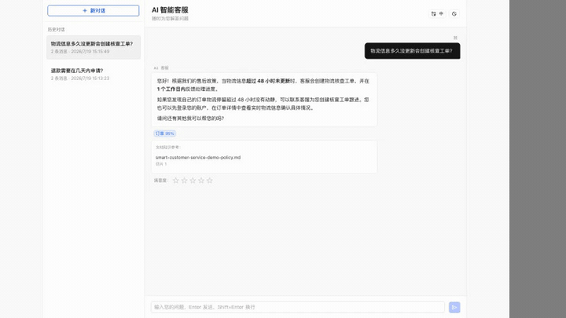
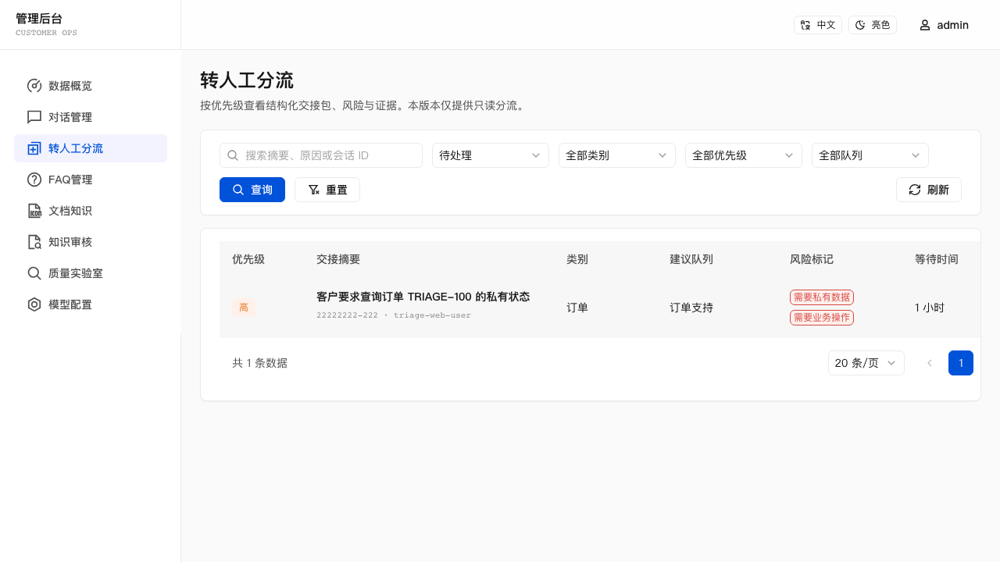
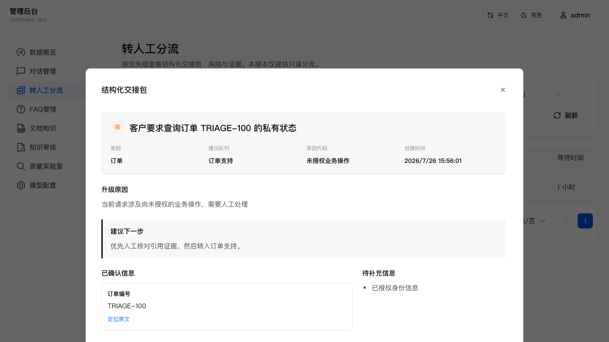
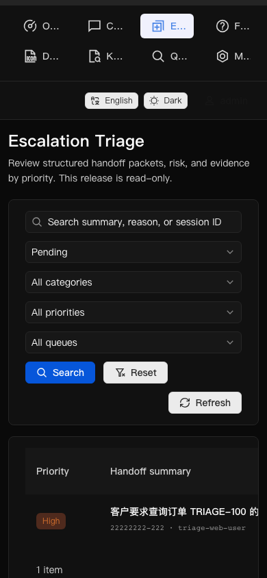

# ResolveWeave

> 证据优先的开源企业级 Agentic 智能客服平台：可信回答、文档 RAG、质量评测
> 和结构化转人工，一套全栈项目直接跑起来。

[](LICENSE)
[](https://nodejs.org/)
[](https://tdesign.tencent.com/react/overview)
[](https://www.sqlite.org/)
[](https://platform.openai.com/docs/api-reference)
[](Dockerfile)
[](https://github.com/Rcloudso/smart-customer-service-ai/actions/workflows/ci.yml)
[](https://github.com/Rcloudso/smart-customer-service-ai/stargazers)

**English version**: [README.md](README.md)

当前版本：**v0.2.9（pre-1.0）**。在 1.0 之前，API 和持久化数据结构仍可能调整。

<p align="center">
  <a href="https://github.com/Rcloudso/smart-customer-service-ai/releases/download/v0.2.6/smart-customer-service-v0.2.6-demo.mp4">
    
  </a>
</p>

<p align="center">
  <a href="https://github.com/Rcloudso/smart-customer-service-ai/releases/download/v0.2.6/smart-customer-service-v0.2.6-demo.mp4">观看文档 RAG 演示（v0.2.6）</a>
  · <a href="docs/case-studies/ai-assisted-development-v0.2.6.md">AI 辅助开发复盘</a>
  · <a href="docs/releases/v0.2.9-evidence.md">v0.2.9 版本验证证据</a>
</p>

ResolveWeave 是一个 pre-1.0 的企业级 Agentic 智能客服平台。它关注的
不只是“能回答”，还包括为什么允许回答、证据不足时如何拒答，以及高风险问题
怎样携带有效上下文交给人工。

当前版本已经把用户聊天、FAQ 与文档知识、混合检索、来源持久化、确定性
Grounding 决策、结构化转人工、运营后台和可重复质量评测放在同一工程内。
没有付费模型 Key 也可以启动基础路径；后续将演进到受限 Agentic Retrieval，
但不会把答案放行或业务操作权限交给模型。

[快速开始](#快速开始) · [为什么做这个项目](#为什么做这个项目) · [特性](#特性) · [架构](ARCHITECTURE.md) · [评测与调试](#评测与调试) · [路线图](ROADMAP.md)

如果你也认同这个方向，可以
[给仓库一个 Star](https://github.com/Rcloudso/smart-customer-service-ai)，
持续关注企业智能客服路线的实现过程。

---

## 它能做什么

用户输入一个客服问题，系统会执行一条完整的智能客服链路：

```text
用户：我想申请退款

ResolveWeave:
  Step 1: 识别问题意图
  Step 2: 用混合检索查找相关 FAQ 和文档切片
  Step 3: 判断证据支持 FAQ 直答、知识生成还是拒答
  Step 4: 返回并保存来源，或把高风险/冲突请求转人工
```

管理员可以维护 FAQ，上传和管理文档，预览已索引切片，查看检索行为与会话记录，并在“知识审核”页面把答不好的问题沉淀成可复用 FAQ。

当前版本适合学习、评测、演示和小规模预生产试用。项目刻意保留
SQLite + 内存向量索引作为零基础设施路径，同时明确列出正式生产仍需补齐的
安全、备份、隔离和可观测能力。

### 产品证据

| 转人工分流队列 | 结构化交接包 | 移动端深色主题 |
| --- | --- | --- |
|  |  |  |

---

## 为什么做这个项目

很多 RAG Demo 停留在“检索几段文字，然后调用一次 LLM”。这个项目把可信度、
运营闭环和验证能力也当成产品功能：

- **先判断证据，再生成回答**——确定性策略先决定 FAQ 直答、基于证据生成、
  拒答还是转人工。
- **知识能够持续运营**——弱回答和负反馈进入知识审核，可以沉淀为可复用知识。
- **转人工不丢上下文**——高风险或冲突问题携带事实、缺失信息、来源、优先级
  和建议队列。
- **用评测驱动改动**——检索与 Grounding 策略必须先通过版本化用例比较，
  才能发布。
- **没有付费模型 Key 也能运行**——fresh clone 可以先体验确定性基础路径，
  再按需配置外部模型。
- **企业方向按版本验证**——结构化入库、OCR、Qdrant 和受限 Agentic
  Retrieval 分开交付，不进行一次性框架重写。

| 当前可用 — v0.2.9 | 下一阶段 — v0.3.x |
| --- | --- |
| FAQ/文档 RAG、混合检索、来源持久化、质量实验室、结构化转人工、双语界面、Docker 和 CI | 结构化入库、OCR/表格/图片知识、可选 Qdrant、检索 Trace、受限 Agentic Retrieval，之后再接 mock 业务工具 |

完整版本边界和非目标见 [ROADMAP.md](ROADMAP.md)。

---

## 特性

- **用户聊天体验** - 支持安全 Markdown 渲染、上下文对话、紧凑文档来源、FAQ 参考、满意度反馈和历史会话。
- **可信回答策略** - 在模型生成前确定 FAQ 直答、基于证据生成或拒答，并持久化决策和来源证据。
- **管理后台** - FAQ 管理、会话列表、数据看板和运行时模型配置。
- **知识缺口反馈闭环** - 无匹配、低检索分和 1–2 星负反馈会进入知识审核，管理员可编辑、忽略或转换为已索引 FAQ。
- **文档 RAG 基座** - 后台上传 TXT、Markdown、含文本层 PDF 和 DOCX，完成解析、语义切片、embedding、索引、重试、启停、预览和删除。
- **多知识源混合检索** - FAQ 与文档分别召回向量候选，再结合字段感知的关键词候选，由统一检索器通过分数感知的倒数排名融合（RRF）合并、去重并保持来源多样性。
- **兼容意图分类** - 结构化输出依次尝试 `json_schema`、`json_object` 和经过严格校验的普通文本 JSON，最后才降级到确定性关键词规则。
- **向量库接口抽象** - `VectorStore` 让默认部署保持简单，也方便后续接入 Qdrant 或 pgvector。
- **更完整的 FAQ embedding** - embedding 文本由问题、回答和关键词共同组成，而不是只使用问题。
- **索引状态管理** - 后台展示启用条目、已索引条目、缺失 embedding、向量维度、上次重建时间和索引错误。
- **检索调试面板** - 后台可以查看命中条目、source、similarity、keywordScore、vectorScore 和排序原因。
- **检索评测能力** - FAQ 和文档固定评测集输出排序指标、分数/来源分布、失败样例，以及 semantic-v1 与仅结构切片的对比。
- **RAG 质量实验室** - 管理员可维护版本化评测集、比较确定性检索与 Grounding 策略、下钻失败样例，并通过门禁发布或回滚不可变运行策略。
- **结构化转人工与分流** - 每条新转人工记录都会保存可追溯交接包，包括确定性优先级、风险标记、建议队列、带消息引用的事实、缺失信息和检索证据；管理员可在独立的双语只读队列中查看。
- **中英文词典** - 固定 UI 文案从可编辑的中英文词典读取，减少硬编码散落在组件里。
- **暗/亮主题切换** - 用户端和后台都支持持久化主题偏好。
- **开源工程化** - 提供 Docker、docker-compose、GitHub Actions CI、Playwright E2E 和中英文文档。

---

## 检索设计

当前检索链路刻意保持务实：

```text
Query
  |
  +-- 通过 VectorStore 按知识来源召回 embedding 候选
  |
  +-- 通过字段感知的 SQL LIKE 和确定性查询扩展召回关键词候选
  |
  +-- 按带命名空间的知识 id 合并去重
  |
  +-- 通过分数感知的倒数排名融合（RRF）排序，并保持来源多样性
  |
  +-- 返回兼容 similarity 字段的匹配结果
```

默认泛型 `VectorStore<KnowledgeIndexItem>` 是内存实现。FAQ 与文档切片 embedding 会序列化存入 SQLite，再以 `faq:<id>` 和 `document:<chunkId>` 命名空间加载到共享进程索引。每条向量同时保存由 provider、模型、endpoint 和输入结构版本生成的 embedding profile；发现旧 profile 时先原子重建持久化向量，再替换进程索引，避免不同模型配置的向量被静默混用。

FAQ 仍然只是知识来源适配器，不是永久的 RAG 边界。TXT、Markdown、含文本层 PDF 与 DOCX 导入使用 `semantic-v1` 语义切片。文档 embedding 包含文档标题和章节标题，GPU 型号清单类问题会在关键词召回前执行确定性词汇扩展。聊天分别召回 FAQ 与文档候选，避免单一来源挤占全部结果。

v0.2.7 在回答生成前评估检索依据。高置信关键词/混合 FAQ 匹配继续确定性直答；非直答证据达到初始检索阈值时，最多把前三条不可信知识材料注入 Prompt；没有证据或证据较弱时不调用回答生成流，直接拒答。答案存在实质差异的重复直达 FAQ，以及规则识别到的私有状态/业务操作请求会被拒绝并转人工。回答模式、阈值结果、原因与 FAQ/文档/切片/页码来源快照会随助手消息保存，恢复历史会话后仍可查看；这些是检索来源，不是逐条事实的引用对齐或蕴含校验。

JSON 与 SSE 写接口还支持可选的 `Idempotency-Key` 请求头：同一键和同一载荷会重放
已保存响应，不重复执行写操作；同键异载荷或仍在处理的并发请求返回 `409`。内置前端为每次
写操作生成幂等键，并在 React 加载状态渲染前通过同步锁阻止快速重复触发。multipart
导入/上传不进入通用响应重放；文档上传继续使用 SHA-256 内容去重。

`FaqMatch` 保留已有的 `similarity` 字段，避免破坏旧响应；同时新增可选调试字段：

- `source`: `vector`、`keyword` 或 `hybrid`
- `keywordScore`
- `vectorScore`
- `fusionScore`、`keywordRank` 和 `vectorRank`

---

## 快速开始

请使用 Node.js 20.16+ 或 22.3+。

```bash
npm install
cp .env.example .env
npm run db:init
npm run db:seed
EMBED_PROVIDER=other npm run dev
```

访问地址：

- 用户聊天页：http://localhost:5173/
- 管理后台：http://localhost:5173/admin

默认本地管理员账号：

```text
用户名：admin
密码：admin123
```

任何接近生产的部署前，都必须修改 `ADMIN_PASSWORD`。当 `NODE_ENV=production` 时，服务端会拦截默认管理员密码。

---

## Docker

```bash
docker compose up --build
```

Docker 默认暴露：

- 前端：http://localhost:5173/
- 后端健康检查：http://localhost:3001/api/health

Compose 示例使用 `EMBED_PROVIDER=other`，所以没有付费模型 Key 时也能启动。确定性本地路径支持 FAQ 与文档检索；文档回答会回退到最高分原文片段。

---

## 配置项

复制 `.env.example` 为 `.env`，然后按需配置：

| 变量 | 用途 |
| --- | --- |
| `JWT_SECRET` | JWT 签名密钥 |
| `ADMIN_USERNAME` / `ADMIN_PASSWORD` | 本地管理员账号 |
| `LLM_PROVIDER` / `EMBED_PROVIDER` | `openai`、`openai-compatible` 或 `other` |
| `LLM_API_BASE` / `LLM_API_KEY` / `LLM_MODEL` | 对话模型地址、仅环境注入的凭据和模型名 |
| `EMBED_API_BASE` / `EMBED_API_KEY` / `EMBED_MODEL` | OpenAI 兼容 embedding 模型 |
| `DOCUMENT_UPLOAD_DIR` | 私有文档文件目录，默认 `./data/uploads` |
| `RATE_LIMIT_CHAT` / `RATE_LIMIT_ADMIN` / `RATE_LIMIT_LOGIN` | API 限流配置 |
| `SESSION_INACTIVITY_MINUTES` | 活跃会话无消息后自动关闭的分钟数，默认 `30` |
| `CONVERSATION_EXPORT_MAX_MESSAGES` | 一次同步筛选 CSV 可导出的完整消息行上限，默认 `5000` |

环境变量是模型配置的唯一生效来源。管理后台模型配置页从环境读取服务商、地址和模型名，并把非敏感修改原子回写到本地 `.env`，当前进程会立即生效；SQLite 中历史 `model_configs` 数据不再覆盖环境配置。`openai` 服务商始终使用 `https://api.openai.com/v1`；只有 `openai-compatible` 和 `other` 使用自定义 API Base URL。管理接口只返回密钥是否已配置，不接收、不返回、不回写 API Key 内容；密钥必须通过环境变量或部署 Secret 注入。容器或托管环境若使用外部注入变量或只读文件系统，应修改部署配置并重新部署，而不是依赖后台写文件。

---

## 评测与调试

运行 FAQ 检索评测：

```bash
EMBED_PROVIDER=other npm run eval:faq
EMBED_PROVIDER=other npm run eval:document
EMBED_PROVIDER=other npm run eval:mixed
EMBED_PROVIDER=other npm run eval:quality
npm run eval:triage
```

评测包含 FAQ 的 Top1/Top3/无匹配指标、覆盖 TXT/Markdown/PDF/DOCX 的 12 条文档用例，以及账户安全、投诉、退款、订单、技术、显式转人工、知识冲突、私有业务操作和提示注入的中英文确定性分流用例。文档评测会对比 `semantic-v1` 与仅结构切片基线，并要求 Top3 100%、MRR 不下降。

文档管理入口位于 **管理后台 → 文档知识**。单文件上限 10 MB、提取文本上限 200,000 字符、语义单元上限 2,000、最终切片上限 300。完全重复内容按 SHA-256 拒绝；接口不返回存储路径、哈希、embedding 或解析器原始异常。

FAQ 评测报告包含：

- Top1 命中率
- Top3 召回率
- 无匹配通过率
- 结果来源分布
- 失败用例的期望和实际命中

管理员也可以在 FAQ 管理页直接输入问题进行检索调试。调试结果会解释命中了什么、为什么排序靠前，以及来源是向量检索、关键词 fallback，还是二者共同命中。

### 知识审核使用流程

1. 一次回答完成后，如果没有 FAQ 结果或第一名检索分低于 `0.55`，系统会保存一条待审核记录；用户给该回答 1–2 星时也会针对同一问答轮次创建或更新记录。
2. 进入 **管理后台 → 知识审核**，查看用户问题、AI 回答、意图、评分，以及回答当时保存的前三条检索依据。
3. 编辑问题、回答、分类和关键词后转为 FAQ；转换成功会自动同步语义索引。
4. 再次提问同一问题，确认新 FAQ 已能命中。没有复用价值的记录可填写可选原因后忽略。

用户明确说“转人工/人工客服”时仍只进入现有转人工流程，不会因为检索结果自动进入知识审核。

满意度评分保持向后兼容：客户端可通过 `messageId` 精确评价某条助手回复，并可同时提交 `sessionId` 做归属校验；旧客户端只传 `sessionId` 时仍评价该会话最后一条助手回复。

---

## 验证命令

```bash
EMBED_PROVIDER=other npm test
EMBED_PROVIDER=other npm run eval:faq
EMBED_PROVIDER=other npm run eval:document
EMBED_PROVIDER=other npm run eval:mixed
EMBED_PROVIDER=other npm run eval:quality
npm run eval:triage
PLAYWRIGHT_CHANNEL=chromium npm run test:e2e
EMBED_PROVIDER=other npm run build
```

GitHub Actions 会在 PR 和推送到 `main` 时运行 `npm ci`、回归测试、Playwright E2E 和生产构建检查。

---

## 项目结构

```text
client/        React + Vite 前端
server/        Express API、服务层、AI 适配器、SQLite 仓储
eval/          FAQ 与文档检索评测用例
tests/e2e/     Playwright 端到端测试
ARCHITECTURE.md 运行拓扑、信任边界和扩容触发条件
data/          本地 SQLite 数据库文件
```

---

## 当前限制

- 默认向量索引在进程内存中，全量遍历 FAQ 与文档切片 embedding，适合 Demo 和小规模知识库，不适合大规模检索。
- embedding 以 JSON 形式存储在 SQLite 中，没有使用专门的向量数据库。
- 文档解析同步运行在 Express 进程内；加密、损坏和扫描 PDF 会返回稳定失败码，尚不支持 OCR、图片知识、网页采集、引用跳转和页码跳转。
- 文档仍属于单一全局知识库；v0.2.9 不包含多租户分库、外部 Worker、文档版本或外部向量存储。
- `VectorStore` 隔离了本地向量操作，但接入网络向量数据库仍需异步契约、健康检查和一致性测试。
- 冲突检测刻意限制为“归一化后问题相同、答案不同”的直达 FAQ；Grounding 阈值通过版本化质量实验室治理，不会自动切换。
- LLM 意图识别失败时会回退到关键词规则。
- 幂等响应仅在单个部署范围内保留 24 小时；multipart 上传依赖各自工作流的重复检查，
  不使用通用响应重放。
- v0.2.9 的转人工分流只读，不包含人工认领、分配、备注、解决动作、实时接管或业务工具。
- 可选 LLM 提取共享 2 秒总预算，只能改进摘要、带引用事实和缺失信息候选；优先级、风险、队列和下一步始终由确定性规则控制。
- 这是一个 pre-1.0 MVP 基座，不是完整生产客服平台。正式生产前应补充可观测性、更严格的鉴权、备份策略和外部向量存储。

---

## Roadmap

有顺序的版本计划见 [ROADMAP.md](ROADMAP.md)。下一阶段重点为：

- v0.3.0：版本化文档表示、清洗与质量门禁、结构感知切片和入库可观测性。
- v0.3.1–v0.3.3：OCR/表格/图片知识、带检索 Trace 的可选 Qdrant，
  再实现由确定性 Grounding Gate 约束的 Agentic Retrieval。
- v0.3.4–v0.3.8：企业知识运营、mock 优先的订单只读工具、人工协作、
  客户身份/记忆和受控写操作。
- v0.4.0：多知识库和租户边界、RBAC、审计、迁移、备份恢复与生产可观测性。
