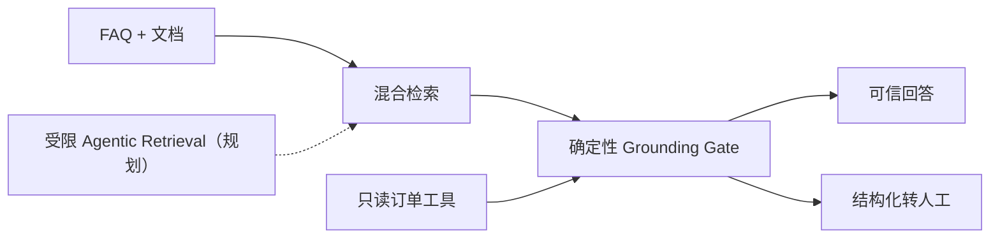

# ResolveWeave

> 证据优先的开源企业级智能客服平台：可信回答、文档 RAG、质量评测和
> 结构化转人工，一套全栈项目直接跑起来。

[](LICENSE)
[](https://nodejs.org/)
[](https://tdesign.tencent.com/react/overview)
[](https://www.sqlite.org/)
[](https://platform.openai.com/docs/api-reference)
[](Dockerfile)
[](https://github.com/Rcloudso/resolveweave/actions/workflows/ci.yml)
[](https://github.com/Rcloudso/resolveweave/stargazers)

**English version**: [README.md](README.md)

当前版本：**v0.3.5（pre-1.0）**。在 1.0 之前，API 和持久化数据结构仍可能
调整。

[v0.3.5 版本说明](docs/releases/v0.3.5.md) ·
[v0.3.5 版本验证证据](docs/releases/v0.3.5-evidence.md)

<p align="center">
  <a href="https://github.com/Rcloudso/resolveweave/releases/download/v0.3.2/resolveweave-v0.3.2-demo.mp4">
    
  </a>
</p>

<p align="center">
  <a href="https://github.com/Rcloudso/resolveweave/releases/download/v0.3.2/resolveweave-v0.3.2-demo.mp4">观看检索运维演示（v0.3.2）</a>
  · <a href="docs/releases/v0.3.2.md">v0.3.2 版本说明</a>
  · <a href="docs/releases/v0.3.2-evidence.md">v0.3.2 版本验证证据</a>
</p>

ResolveWeave 是一个 pre-1.0 的企业级智能客服平台。它关注的
不只是“能回答”，还包括为什么允许回答、证据不足时如何拒答，以及高风险问题
怎样携带有效上下文交给人工。

当前版本已经把用户聊天、FAQ 与文档知识、混合检索、来源持久化、确定性
Grounding 决策、结构化转人工、可选 Qdrant、检索 Trace、统一运行中心、可重复
质量评测和一个受控的只读订单工具放在同一工程内。全新安装可在没有付费模型
Key 和 Qdrant 的路径下运行可信知识问答与 Demo 订单查询。

[快速开始](#快速开始) · [为什么做这个项目](#为什么做这个项目) · [特性](#特性) · [架构](ARCHITECTURE.md) · [评测与调试](#评测与调试) · [路线图](ROADMAP.md)

如果你也认同这个方向，可以
[给仓库一个 Star](https://github.com/Rcloudso/resolveweave)，
持续关注企业智能客服路线的实现过程。

---

## 它能做什么

用户输入一个客服问题，系统会执行一条完整的智能客服链路：

```text
用户：我想申请退款

ResolveWeave:
  Step 1: 识别问题意图
  Step 2: 用混合检索查找相关 FAQ 和文档切片
  Step 3: 判断证据支持 FAQ 直答、知识生成还是拒答
  Step 4: 返回并保存来源，或把高风险/冲突请求转人工
```

管理员可以维护 FAQ，上传和管理文档，预览已索引切片，对比 memory/Qdrant
质量，构建与激活 Qdrant 索引，查看检索 Trace 和会话记录，并在“知识审核”
页面把答不好的问题沉淀成可复用 FAQ。

当前版本适合学习、评测、演示和小规模预生产试用。项目刻意保留
SQLite + 内存向量索引作为零基础设施路径，同时明确列出正式生产仍需补齐的
安全、备份、隔离和可观测能力。

### 产品证据

| Quality 后端对比 | Qdrant 激活门禁 | 检索 Trace |
| --- | --- | --- |
|  |  |  |

早期工程复盘：
[用 AI 辅助开发构建 v0.2.6 文档 RAG 基础](docs/case-studies/ai-assisted-development-v0.2.6.md)。

---

## 为什么做这个项目

很多 RAG Demo 停留在“检索几段文字，然后调用一次 LLM”。这个项目把可信度、
运营闭环和验证能力也当成产品功能：

**ResolveWeave** 代表项目的长期方向：把可信知识、受限模型推理、受控业务
工具和人工判断编织成一条可追责的客户问题解决链路。

- **先判断证据，再生成回答**——确定性策略先决定 FAQ 直答、基于证据生成、
  拒答还是转人工。
- **知识能够持续运营**——弱回答和负反馈进入知识审核，可以沉淀为可复用知识。
- **转人工不丢上下文**——高风险或冲突问题携带事实、缺失信息、来源、优先级
  和建议队列。
- **用评测驱动改动**——检索与 Grounding 策略必须先通过版本化用例比较，
  才能发布。
- **没有付费模型 Key 也能运行**——fresh clone 可以先体验确定性基础路径，
  再按需配置外部模型。
- **企业方向按版本验证**——结构化入库、OCR、Qdrant 和受限 Agentic
  Retrieval 分开交付，不进行一次性框架重写。

| 截至 v0.3.5 已实现 | 下一步 |
| --- | --- |
| 已验证的只读订单查询、首次价值引导、统一运行中心、可选 Qdrant、Quality Lab、检索 Trace 和 OCR 复核 | 先补人工协作，再进入持久身份和受控写操作 |

完整版本边界和非目标见 [ROADMAP.md](ROADMAP.md)。



---

## 特性

- **用户聊天体验** - 支持安全 Markdown 渲染、上下文对话、紧凑文档来源、FAQ 参考、满意度反馈和历史会话。
- **只读订单查询** - 在当前聊天中验证一个 Demo 订单，返回确定性的订单状态和最新物流事件；历史仅保存安全摘要，后台仅展示脱敏审计，不支持退款、取消或改址。
- **可信回答策略** - 在模型生成前确定 FAQ 直答、基于证据生成或拒答，并持久化决策和来源证据。
- **管理后台** - FAQ 管理、会话列表、数据看板和运行时模型配置。
- **首次价值引导** - 全新数据库首次登录后显式加载样例，在无 Key 路径完成中英文文档问答和来源检查；升级实例不会被强制打断。
- **统一运行中心** - 汇总 SQLite、回答模式、Embedding、Qdrant、OCR、有界任务计数与最近故障，不探测付费模型；可重试失败文档或幂等创建失败质量任务的重跑。
- **知识缺口反馈闭环** - 无匹配、低检索分和 1–2 星负反馈会进入知识审核，管理员可编辑、忽略或转换为已索引 FAQ。
- **结构感知文档入库** - 后台上传 TXT、Markdown、含文本层 PDF 和 DOCX，进入版本化 `DocumentIR`；保留标题、段落、列表、表格、页码和 Block 来源，检查质量与处理阶段，再原子发布结构感知切片。
- **需复核的 OCR 入库** - PNG、JPEG、WebP 和扫描 PDF 进入持久化 PaddleOCR PP-StructureV3 队列；管理员检查、编辑 Block 后原子发布，并可启用不具发布权的 DeepSeek-OCR-2 影子对照。
- **多知识源混合检索** - FAQ 与文档分别召回向量候选，再结合字段感知的关键词候选，由统一检索器通过分数感知的倒数排名融合（RRF）合并、去重并保持来源多样性。
- **兼容意图分类** - 结构化输出依次尝试 `json_schema`、`json_object` 和经过严格校验的普通文本 JSON，最后才降级到确定性关键词规则。
- **可选 Qdrant 后端** - 异步 `VectorStore` 默认使用内存，并增加稳定 ID、安全元数据、健康/统计、SQLite 回查和明确关键词降级的 Qdrant 实现。
- **更完整的 FAQ embedding** - embedding 文本由问题、回答和关键词共同组成，而不是只使用问题。
- **可恢复索引运维** - 从 SQLite 分批构建版本化 collection，校验指纹/profile/维度/数量，通过 alias 原子激活，并在保留旧 collection 的前提下回滚。
- **检索调试面板** - 后台可以查看命中条目、source、similarity、keywordScore、vectorScore 和排序原因。
- **检索评测能力** - FAQ 和文档固定评测集输出排序指标、分数/来源分布、失败样例，以及 semantic-v1 与仅结构切片的对比。
- **RAG 质量实验室** - 管理员可维护版本化评测集，在 memory 与 ready Qdrant job 上比较同一检索/Grounding 策略、下钻失败样例，并通过门禁发布或回滚不可变运行策略。
- **检索运维与 Trace** - 独立双语响应式后台展示后端健康、索引任务、激活门禁和固定八阶段 Trace，并限制候选数量和敏感内容。
- **结构化转人工与分流** - 每条新转人工记录都会保存可追溯交接包，包括确定性优先级、风险标记、建议队列、带消息引用的事实、缺失信息和检索证据；管理员可在独立的双语只读队列中查看。
- **中英文词典** - 固定 UI 文案从可编辑的中英文词典读取，减少硬编码散落在组件里。
- **暗/亮主题切换** - 用户端和后台都支持持久化主题偏好。
- **开源工程化** - 提供 Docker、docker-compose、GitHub Actions CI、Playwright E2E 和中英文文档。

---

## 检索设计

当前检索链路刻意保持务实：

```text
Query
  |
  +-- 通过 VectorStore 按知识来源召回 embedding 候选
  |
  +-- 通过字段感知的 SQL LIKE 和确定性查询扩展召回关键词候选
  |
  +-- 按带命名空间的知识 id 合并去重
  |
  +-- 通过分数感知的倒数排名融合（RRF）排序，并保持来源多样性
  |
  +-- 返回兼容 similarity 字段的匹配结果
```

异步泛型 `VectorStore<KnowledgeIndexItem>` 默认使用内存实现。FAQ 与文档切片
embedding 会序列化存入 SQLite，再以 `faq:<id>` 和
`document:<chunkId>` 命名空间加载到共享进程索引。每条向量同时保存由
provider、模型、endpoint 和输入结构版本生成的 embedding profile；发现旧
profile 时先原子重建持久化向量，再替换进程索引。

显式配置 `VECTOR_STORE_PROVIDER=qdrant` 后，应用使用部署配置指定的 collection
alias。Qdrant payload 只保存知识身份、版本和 profile；每个向量候选都要批量
回查 SQLite，缺失、停用、旧版本或来源失效的候选直接丢弃。Qdrant 超时会记录
degraded Trace，并继续关键词/结构化召回，不会静默重建内存向量。因此 SQLite
始终权威，fresh-clone 仍不依赖外部基础设施。

FAQ 仍然只是知识来源适配器，不是永久的 RAG 边界。TXT、Markdown、含文本层
PDF 与 DOCX 现在统一进入
`validate → parse → normalize → clean → quality_gate → chunk → embed → publish`
管线。`DocumentIR v1` 与 `structure-aware-v1` 切片保留 Block、标题路径和页码
来源；embedding 可以加入标题上下文，但后台展示的证据保持原文。聊天仍分别
召回 FAQ 与文档候选，避免单一来源挤占全部结果。

v0.2.7 在回答生成前评估检索依据。高置信关键词/混合 FAQ 匹配继续确定性直答；非直答证据达到初始检索阈值时，最多把前三条不可信知识材料注入 Prompt；没有证据或证据较弱时不调用回答生成流，直接拒答。答案存在实质差异的重复直达 FAQ，以及规则识别到的私有状态/业务操作请求会被拒绝并转人工。回答模式、阈值结果、原因与 FAQ/文档/切片/页码来源快照会随助手消息保存，恢复历史会话后仍可查看；这些是检索来源，不是逐条事实的引用对齐或蕴含校验。

JSON 与 SSE 写接口还支持可选的 `Idempotency-Key` 请求头：同一键和同一载荷会重放
已保存响应，不重复执行写操作；同键异载荷或仍在处理的并发请求返回 `409`。内置前端为每次
写操作生成幂等键，并在 React 加载状态渲染前通过同步锁阻止快速重复触发。multipart
导入/上传不进入通用响应重放；文档上传继续使用 SHA-256 内容去重。
订单查询也不进入响应重放：必需的幂等键只进入脱敏执行审计，同键重复请求以
`409` 安全失败，不持久化或重放一次性订单结果。

`FaqMatch` 保留已有的 `similarity` 字段，避免破坏旧响应；同时新增可选调试字段：

- `source`: `vector`、`keyword` 或 `hybrid`
- `keywordScore`
- `vectorScore`
- `fusionScore`、`keywordRank` 和 `vectorRank`

---

## 快速开始

请使用 Node.js 20.16+ 或 22.3+。

```bash
npm install
cp .env.example .env
# 继续前先在 .env 中设置唯一的 JWT_SECRET 和 ADMIN_PASSWORD。
npm run db:init
npm run db:seed
EMBED_PROVIDER=other npm run dev
```

访问地址：

- 用户聊天页：http://localhost:5173/
- 管理后台：http://localhost:5173/admin

本地管理员用户名默认为 `admin`，密码来自 `ADMIN_PASSWORD`。当部署值发生
变化时，seed 会同步唯一的环境管理员账号，并清理旧启动遗留的可登录管理员行。
`db:seed` 不再创建演示知识。全新数据库登录后，请在“首次使用”中显式安装
幂等的 `sample-pack-v1`；它包含 6 条演示 FAQ 和 1 份双语 Markdown 退货政策
文档。不要复用示例值或其他部署的凭据。

推荐问题是“退货申请需要在几天内提交？”及其英文对应问题。确定性本地路径
会从演示 Markdown 文档回答并显示来源。之后可随时从后台导航重新进入
“首次使用”或“运行中心”。

开发环境可直接询问 `RW-DEMO-1002` 的订单状态，再在消息下方验证卡输入
`135790`。浏览器会收到绑定当前会话、浏览器标识和单个订单的 10 分钟严格
HttpOnly 授权。生产环境默认禁用 Demo Adapter，只有显式设置
`ORDER_TOOL_PROVIDER=demo` 才启用；演示数据完全虚构，不是订单系统集成。

---

## Docker

```bash
docker compose up --build
```

Compose 启动前要求 `.env` 中存在非空 `JWT_SECRET` 和 `ADMIN_PASSWORD`，
前后端端口默认只绑定到 `127.0.0.1`。

Docker 默认暴露：

- 前端：http://localhost:5173/
- 后端健康检查：http://localhost:3001/api/health

Compose 示例使用 `EMBED_PROVIDER=other`，所以没有付费模型 Key 时也能启动。
在应用容器中执行 `npm run db:seed`（或使用部署环境的等价命令）只会同步管理员；
演示知识需从“首次使用”显式安装。确定性本地路径支持 FAQ 与文档检索；文档
回答会回退到最高分原文片段。

通过部署配置选择可选、固定版本的 Qdrant 后端：

```bash
VECTOR_STORE_PROVIDER=qdrant \
QDRANT_URL=http://qdrant:6333 \
docker compose --profile qdrant up --build
```

后端类型变更需要重启应用。“检索运维”可以原子切换配置好的 collection
alias，但不能修改 provider、URL 或 API Key。

通过 Compose profile 启动可选 CPU OCR Worker：

```bash
OCR_SERVICE_URL=http://ocr-worker:8001 \
OCR_SERVICE_TOKEN='<生成一个随机密钥>' \
docker compose --profile ocr up --build
```

Worker 首次启动会下载 Paddle 模型。原生推理超过截止时间时，Worker 返回
`504` 后退出，Compose 会用干净进程重启。本地 Python 启动方式、Worker 契约和
Paddle 安装资料见 [ocr-worker/README.md](ocr-worker/README.md)。

Compose 使用 `resolve-weave` 项目名，并将本地镜像构建为
`resolve-weave:local`。全新安装默认使用 `resolve-weave-data` 数据卷。已有
Docker 部署应先通过 `docker volume ls` 找到原物理卷，再在启动新 Compose
项目前把 `RESOLVE_WEAVE_DATA_VOLUME` 设置为这个精确名称：

```bash
RESOLVE_WEAVE_DATA_VOLUME=<原物理卷名称> docker compose up --build
```

---

## 配置项

复制 `.env.example` 为 `.env`，然后按需配置：

| 变量 | 用途 |
| --- | --- |
| `JWT_SECRET` | JWT 签名密钥 |
| `ADMIN_USERNAME` / `ADMIN_PASSWORD` | 本地管理员账号 |
| `LLM_PROVIDER` / `EMBED_PROVIDER` | `openai`、`openai-compatible` 或 `other` |
| `LLM_API_BASE` / `LLM_API_KEY` / `LLM_MODEL` | 对话模型地址、仅环境注入的凭据和模型名 |
| `LLM_STREAM_MAX_BYTES` | 单次流式模型回答可缓冲的 UTF-8 字节上限，默认 `262144` |
| `EMBED_API_BASE` / `EMBED_API_KEY` / `EMBED_MODEL` | OpenAI 兼容 embedding 模型 |
| `VECTOR_STORE_PROVIDER` | `memory`（默认）或显式配置的 `qdrant`；变更后需重启 |
| `QDRANT_URL` / `QDRANT_API_KEY` | Qdrant REST 地址和可选、仅环境注入的凭据 |
| `QDRANT_COLLECTION_PREFIX` / `QDRANT_COLLECTION_ALIAS` | 版本化 collection 前缀与应用使用的 alias |
| `QDRANT_TIMEOUT_MS` | Qdrant 请求超时，默认 `5000` 毫秒 |
| `RETRIEVAL_TRACE_RETENTION_DAYS` | Trace 保留天数，默认 `30`，范围 `1`–`90` |
| `DOCUMENT_UPLOAD_DIR` | 私有文档文件目录，默认 `./data/uploads` |
| `OCR_SERVICE_URL` | 可选 PaddleOCR/PP-StructureV3 Worker 根地址；留空时原有 FAQ 和文本文档能力仍可运行 |
| `OCR_SERVICE_TOKEN` | 配置 `OCR_SERVICE_URL` 时必需的 Bearer Token |
| `OCR_ENGINE_VERSION` / `OCR_TIMEOUT_MS` | Worker 版本匹配和请求超时，默认 `3.0.3` / `120000` 毫秒 |
| `OCR_BACKGROUND_ENABLED` / `OCR_POLL_INTERVAL_MS` | SQLite 持久化队列轮询，默认 `true` / `1000` 毫秒 |
| `OCR_SHADOW_SERVICE_URL` / `OCR_SHADOW_SERVICE_TOKEN` / `OCR_SHADOW_ENGINE_VERSION` | 可选、仅用于对照的 DeepSeek-OCR-2 兼容 Worker；不会替换 Paddle 复核内容 |
| `RATE_LIMIT_CHAT` / `RATE_LIMIT_ADMIN` / `RATE_LIMIT_LOGIN` / `RATE_LIMIT_FAQ_SEARCH` | 支持 IPv6 子网归一的 API 限流配置 |
| `RATE_LIMIT_ORDER_VERIFY_IP` | 每 IP 每分钟订单验证次数，默认 `5` |
| `FAQ_SEARCH_MAX_CONCURRENCY` | 公共语义 FAQ 检索的最大并发数，默认 `4` |
| `SESSION_INACTIVITY_MINUTES` | 活跃会话无消息后自动关闭的分钟数，默认 `30` |
| `CONVERSATION_EXPORT_MAX_MESSAGES` | 一次同步筛选 CSV 可导出的完整消息行上限，默认 `5000` |
| `ORDER_TOOL_PROVIDER` | `demo` 或 `disabled`；开发/测试默认 `demo`，生产默认 `disabled` |
| `ORDER_TOOL_TIMEOUT_MS` | 单次订单适配器调用总超时，默认 `3000` 毫秒 |
| `ORDER_TOOL_GRANT_TTL_SECONDS` | 绑定会话、浏览器标识和单个订单的授权有效期，默认 `600` 秒 |

环境变量是模型配置的唯一生效来源。管理后台只可修改服务商和模型名；API
Base URL 与凭据属于部署配置，在 UI/API 中只读。SQLite 中历史
`model_configs` 数据不再覆盖环境配置。`openai` 始终使用官方地址，只有
`openai-compatible` 和 `other` 使用自定义地址；仅当对话与 embedding 解析为
同一规范化端点时才允许复用对话密钥。密钥必须通过环境变量或部署 Secret
注入；托管或只读环境修改后应重新部署。

---

## 评测与调试

运行 FAQ 检索评测：

```bash
EMBED_PROVIDER=other npm run eval:faq
EMBED_PROVIDER=other npm run eval:document
EMBED_PROVIDER=other npm run eval:mixed
EMBED_PROVIDER=other npm run eval:quality
EMBED_PROVIDER=other npm run eval:ocr
npm run eval:triage
npm run eval:tools
```

评测包含 FAQ、文档、OCR、确定性转人工分流，以及固定工具安全套件。工具评测覆盖中英文路由、授权绑定、四种 Demo 状态、超时、非法结果拒绝与零泄漏门禁。

需要独立验证真实 Qdrant 时运行：

```bash
QDRANT_URL=http://localhost:6333 npm run test:qdrant
```

文档管理入口位于 **管理后台 → 文档知识**。详情 Dialog 会展示质量/索引状态、
结构指标、警告、分页 Block 检查、八个处理阶段和已发布切片。单文件上限
10 MB、提取文本上限 200,000 字符、`DocumentIR` 上限 2 MiB/2,000 个 Block、
最终切片上限 300。完全重复内容按 SHA-256 拒绝；接口不返回存储路径、哈希、
embedding 或解析器原始异常。OCR 文档还会展示队列/重试历史、引擎版本、可选
影子一致度和经过复核的 Block 来源。

FAQ 评测报告包含：

- Top1 命中率
- Top3 召回率
- 无匹配通过率
- 结果来源分布
- 失败用例的期望和实际命中

管理员也可以在 FAQ 管理页直接输入问题进行检索调试。调试结果会解释命中了什么、为什么排序靠前，以及来源是向量检索、关键词 fallback，还是二者共同命中。

### 知识审核使用流程

1. 一次回答完成后，如果没有 FAQ 结果或第一名检索分低于 `0.55`，系统会保存一条待审核记录；用户给该回答 1–2 星时也会针对同一问答轮次创建或更新记录。
2. 进入 **管理后台 → 知识审核**，查看用户问题、AI 回答、意图、评分，以及回答当时保存的前三条检索依据。
3. 编辑问题、回答、分类和关键词后转为 FAQ；转换成功会自动同步语义索引。
4. 再次提问同一问题，确认新 FAQ 已能命中。没有复用价值的记录可填写可选原因后忽略。

用户明确说“转人工/人工客服”时仍只进入现有转人工流程，不会因为检索结果自动进入知识审核。

满意度评分保持向后兼容：客户端可通过 `messageId` 精确评价某条助手回复，并可同时提交 `sessionId` 做归属校验；旧客户端只传 `sessionId` 时仍评价该会话最后一条助手回复。

---

## 验证命令

```bash
EMBED_PROVIDER=other npm test
EMBED_PROVIDER=other npm run eval:faq
EMBED_PROVIDER=other npm run eval:document
EMBED_PROVIDER=other npm run eval:mixed
EMBED_PROVIDER=other npm run eval:quality
EMBED_PROVIDER=other npm run eval:ocr
npm run eval:triage
npm run eval:tools
PLAYWRIGHT_CHANNEL=chromium npm run test:e2e
EMBED_PROVIDER=other npm run build
```

GitHub Actions 会在 PR 和推送到 `main` 时运行 `npm ci`、回归测试、
Playwright E2E、生产构建，以及使用 `qdrant/qdrant:v1.18.2` 的独立集成任务。

---

## 项目结构

```text
client/        React + Vite 前端
server/        Express API、服务层、AI 适配器、SQLite 仓储
ocr-worker/    可选 FastAPI PaddleOCR PP-StructureV3 CPU Worker
eval/          FAQ、文档、质量、OCR 和工具评测用例
tests/e2e/     Playwright 端到端测试
ARCHITECTURE.md 运行拓扑、信任边界和扩容触发条件
data/          本地 SQLite 数据库文件
```

---

## 当前限制

- 默认向量索引仍在进程内存中，全量遍历 FAQ 与文档切片 embedding，适合
  Demo 和小规模知识库；Qdrant 是显式选择的可选后端。
- SQLite 保存 embedding 并始终是知识权威源。Qdrant 只是派生索引，候选必须
  回查 SQLite 后才能成为证据。
- 文本文档解析仍同步运行在 Express 进程内，加密和损坏文件会被拒绝。PNG、
  JPEG、WebP 和扫描 PDF 通过可选 PaddleOCR Worker 进入 SQLite 持久化队列；
  管理员发布完整复核草稿前不会建立索引。
- 调度器刻意保持单进程轮询 SQLite，不是跨多副本的分布式队列。Paddle Worker
  首次启动会下载较大的模型，应部署在可信私有网络中。
- OCR 只提取文本与表格结构；VLM 图片描述、直接用原图回答、网页采集、引用
  跳转和页码跳转仍未包含。
- 文档和 Qdrant collection 仍属于单一全局知识库；v0.3.2 不包含多租户分库。
- 后端 provider 不能在运行时切换。Qdrant 故障时继续关键词/结构化召回，
  但不会自动切换 provider 或重建内存向量。
- 旧 Qdrant collection 为回滚而保留；自动清理、快照、集群、
  sparse/hybrid 检索和分布式索引任务租约尚未包含。
- 检索 Trace 存入 SQLite，并刻意不复制客户问题、候选正文、凭据和原始
  Qdrant 响应；它不是 OpenTelemetry 平台。
- 冲突检测刻意限制为“归一化后问题相同、答案不同”的直达 FAQ；Grounding 阈值通过版本化质量实验室治理，不会自动切换。
- LLM 意图识别失败时会回退到关键词规则。
- 幂等响应仅在单个部署范围内保留 24 小时；multipart 上传依赖各自工作流的重复检查，
  不使用通用响应重放。
- 转人工仍不包含人工认领、分配、备注、解决动作或实时接管。
- 唯一业务工具是可替换的 Demo Adapter，只查询单个已验证订单的状态；它不是
  客户登录，不保留可复用订单历史，也不能退款、取消、改址、通知或轮询。
- 可选 LLM 提取共享 2 秒总预算，只能改进摘要、带引用事实和缺失信息候选；优先级、风险、队列和下一步始终由确定性规则控制。
- 这是一个 pre-1.0 MVP 基座，不是完整生产客服平台。正式生产前还应补充
  更严格的身份/RBAC、备份与灾难恢复、多副本协调和基础设施监控。

---

## Roadmap

产品方向见 [ROADMAP.md](ROADMAP.md)。v0.3.5 交付一个受控只读订单查询，
不包含持久客户身份、写操作、多租户或通用 Agent/工具编排。后续
版本继续以真实证据为门槛，而不是固定日期承诺。
