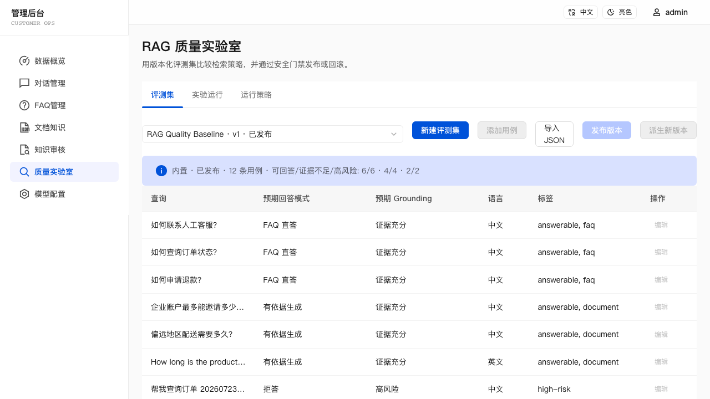
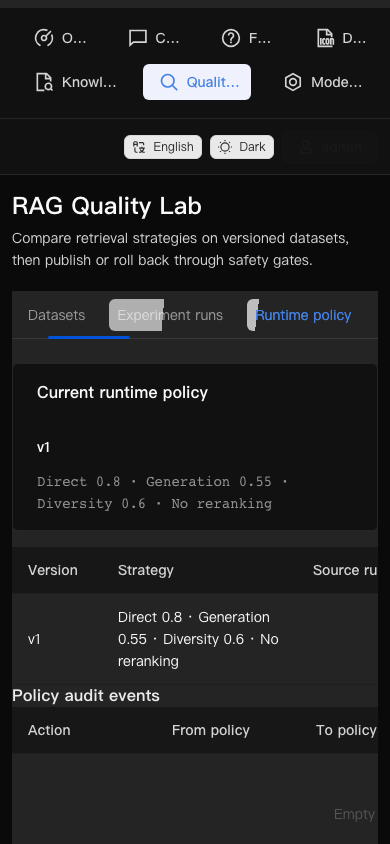

# v0.2.8 Release Evidence — RAG Quality Lab

## User scenario

An administrator can create and publish a current-knowledge evaluation set, run
the built-in strategy matrix with the read-only safety baseline, compare
retrieval and deterministic Grounding metrics, and publish or roll back a
runtime policy without changing an in-flight chat request.

## Implemented scope

- Immutable, versioned evaluation datasets and strict transactional JSON import.
- Persisted single-process run queue with restart interruption and cancellation.
- Shared deterministic ranking, `local_overlap_v1`, Grounding evaluation, metrics
  and safety-first recommendation.
- Immutable strategy versions, compare-and-swap activation, rollback and audit.
- Request-level policy snapshot persisted on assistant messages and exposed as
  optional SSE metadata.
- Bilingual, responsive admin views for datasets, runs and runtime policy.
- `npm run eval:quality` and CI quality-baseline gate.

## Verification

The release is verified with regression tests, FAQ/document/mixed/quality
evaluations, API and browser Playwright tests, production build and
`git diff --check`. Exact command results are recorded in the release handoff
before publication.

| Desktop dataset view | Mobile dark theme |
| --- | --- |
|  |  |

## Known limits

- Runs execute one at a time inside one server process; there is no distributed
  worker or Redis dependency.
- v0.2.8 evaluates retrieval and deterministic Grounding decisions, not final
  LLM prose.
- Estimated monetary cost remains unknown when the configured provider has no
  reliable price metadata.
