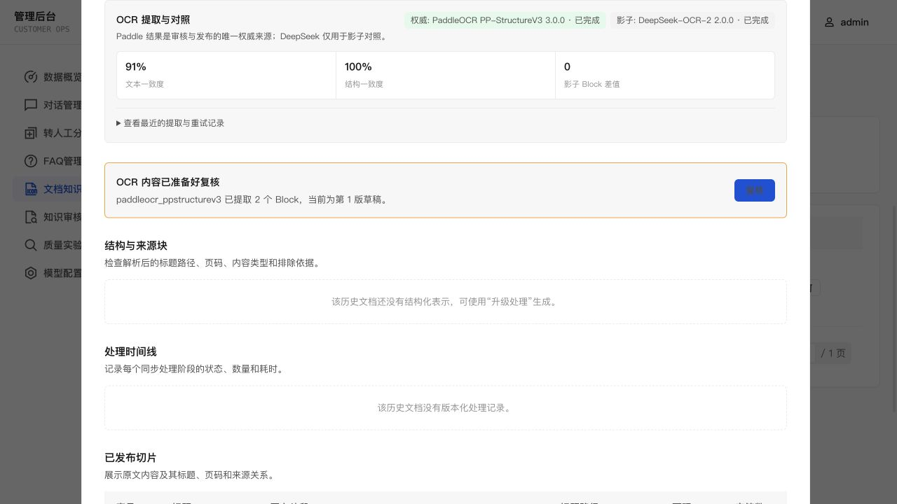
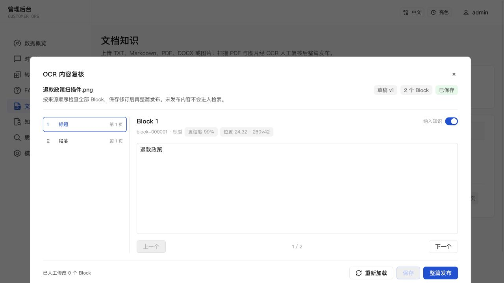
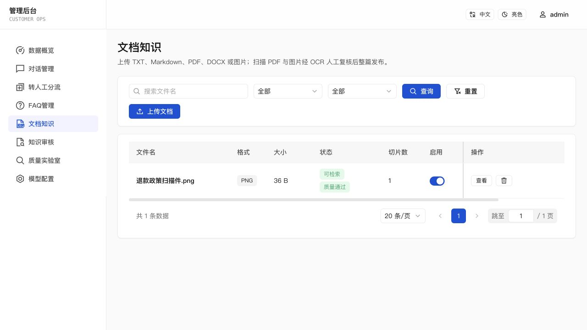
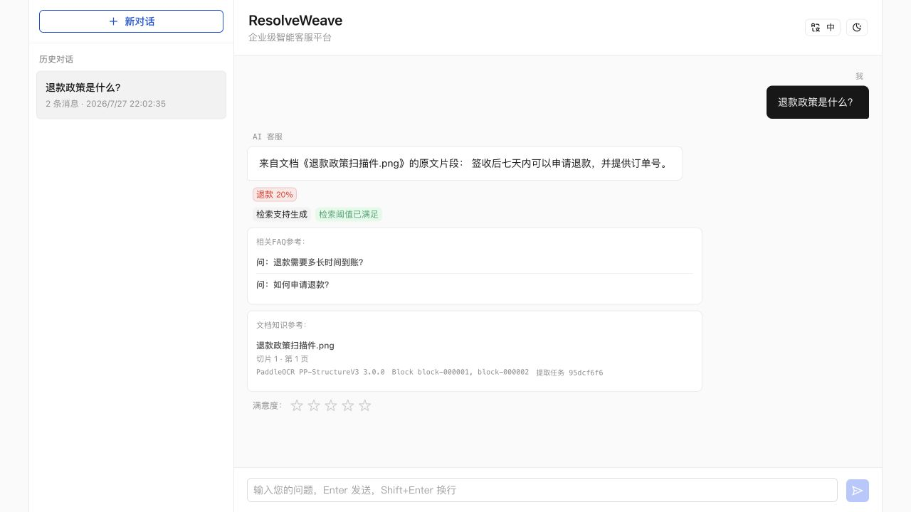

# v0.3.1 Implementation Evidence — Multimodal Knowledge Review

> Status: release-ready implementation evidence. An annotated tag and GitHub
> Release are created only after the branch is merged and the publication
> action is explicitly approved.

## User scenario

1. Sign in and upload a PNG/JPEG/WebP screenshot or scan-only PDF from
   **Admin Console → Documents**.
2. Observe the durable extraction state while the list refreshes.
3. Open the review workspace, inspect page/layout/confidence evidence, edit one
   or more Blocks, and save against the current revision.
4. Publish the complete draft and verify that no partial content appeared
   before publication.
5. Ask a matching customer question and inspect the document source card for
   page, Block, extraction job, and engine provenance.
6. When an optional DeepSeek-compatible shadow worker is configured, inspect
   comparison metrics without changing the Paddle review source.

## Verification coverage

The v0.3.1 suite covers:

- PNG/JPEG/WebP/PDF extension, MIME, signature, size, SHA-256, and duplicate
  validation;
- additive SQLite migrations for extraction jobs, immutable results,
  revisioned drafts, and chunk extraction provenance;
- queued/running/succeeded/failed lifecycle, interrupted-job recovery, safe
  retry relationships, and authoritative/shadow separation;
- strict worker request/result contracts, engine/version matching, response
  limits, fake worker timeouts/failures, and the local PP-StructureV3 mapper;
- scan-only PDF routing while text-layer PDFs stay on the existing parser;
- stale draft revisions, invalid edited structures, immutable source results,
  and manual-edit tracking;
- complete-draft quality/chunk/embed/publish behavior plus database/index
  compensation on failure;
- persisted document/page/Block/job/engine provenance in retrieval snapshots,
  chat source cards, and restored conversations;
- bilingual desktop/mobile OCR review, comparison, retry history, and source
  provenance workflows.

## Evaluation

`eval/ocr-cases.json` contains six strict contract fixtures:

- Chinese screenshot;
- English screenshot;
- two-page scan PDF;
- structured table;
- rotated/noisy content;
- deliberately low-quality output.

Current OCR contract benchmark:

- cases: 6;
- accepted: 5;
- average character error rate: 1.33%;
- Block-kind accuracy: 100%;
- page-count accuracy: 100%;
- table-cell accuracy: 100%;
- low-quality detection: 100%.

This fixture benchmark validates the project-owned OCR contract and quality
gates. It is deterministic and does not claim a hardware/model benchmark
against real private documents.

## Verification commands

```bash
(cd ocr-worker && python3 -m unittest discover -s tests)
EMBED_PROVIDER=other npm test
EMBED_PROVIDER=other npm run eval:faq
EMBED_PROVIDER=other npm run eval:document
EMBED_PROVIDER=other npm run eval:mixed
EMBED_PROVIDER=other npm run eval:quality
EMBED_PROVIDER=other npm run eval:ocr
PLAYWRIGHT_CHANNEL=chromium npm run test:e2e
EMBED_PROVIDER=other npm run build
git diff --check
```

Checked locally on 2026-07-27:

- local worker mapper/signature tests: 2/2 passed;
- full runtime/unit/service/API regression suite and both TypeScript checks:
  passed;
- FAQ: Top1 100%, Top3 100%, no-match 100%;
- documents: Top3 100%, MRR 0.958 for both semantic-v1 and structure baseline;
- mixed knowledge: 6/6 Top1;
- Quality Lab: Recall@1/3, MRR, and decision accuracy 100%, with zero unsafe,
  over-refused, or failed cases;
- triage: category, priority, and queue accuracy 100%, with zero dangerous
  under-prioritization;
- OCR contract benchmark: all configured gates passed with the metrics above;
- Playwright API/Web: 46/46 passed, including the reviewed OCR publication and
  provenance workflow;
- production TypeScript/Vite build: passed;
- dictionary/fixture/package JSON parsing and `git diff --check`: passed.

Docker is not installed in the verification environment, so
`docker compose config` and a real Paddle model/container startup were not run
locally. The worker Dockerfile and Compose profile remain a deployment
verification item.

## Visual evidence

The accepted screenshots were captured from the isolated local application
with a realistic Paddle authoritative result and DeepSeek shadow result.

| Engine comparison | Block review | Published knowledge | Chat provenance |
| --- | --- | --- | --- |
|  |  |  |  |

The visual review found that the review footer could fall below a common
1280×720 viewport. The workspace height was made viewport-aware and the flow
was captured again with reload, save, and whole-document publish actions
visible. The same isolated run then edited one Block, saved revision 2,
published the document, retrieved it in customer chat, and displayed the OCR
provenance. Screenshot inspection does not prove screen-reader behavior; mobile
overflow, bilingual copy, keyboard interaction, and the publication flow are
covered by Playwright.

## Known limits and deployment risks

- The durable scheduler is single-process and SQLite-backed. It recovers
  interrupted jobs but does not coordinate leases across multiple replicas.
- The optional Paddle worker downloads large models on first start and should
  not be exposed directly to the public internet.
- DeepSeek shadow execution requires a separately deployed endpoint that
  implements the same project contract; it is optional and never authoritative.
- OCR reading order, table structure, and confidence can still be wrong.
  Review is mandatory before publication.
- Image-only DOCX, free-form VLM descriptions, multimodal embeddings, raw-image
  answering, page jumps, and distributed OCR execution remain out of scope.
