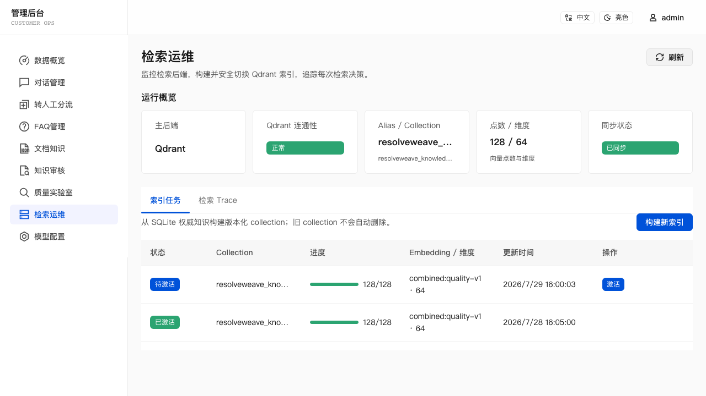
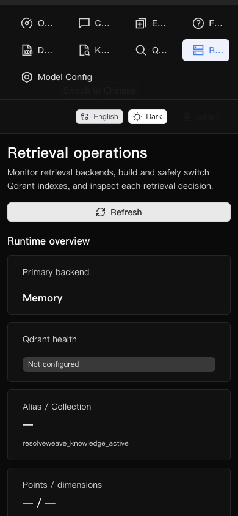
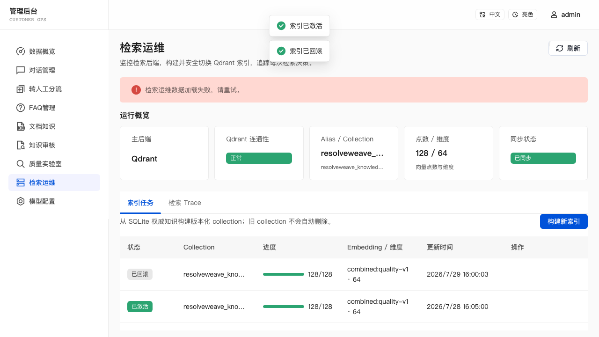

# v0.3.2 Release Evidence — Qdrant & Retrieval Observability

> Status: release verification evidence captured before branch merge,
> annotated tag, and GitHub Release publication.

## User scenario

1. Keep a fresh clone on the default in-memory vector backend, or explicitly
   configure Qdrant and restart the application.
2. Open **Admin Console → Retrieval Operations** and verify backend health,
   alias/collection, vector count, dimension, and synchronization state.
3. Build a versioned collection from current SQLite knowledge. Resume an
   interrupted batch only while the knowledge fingerprint remains unchanged.
4. Select the ready index as a Quality Lab backend target and compare it with
   the memory baseline under the same dataset, policy, and query embeddings.
5. Inspect the activation gate. A P95 latency increase above 25% requires an
   explicit acknowledgement before the atomic alias switch.
6. Ask a customer question, inspect the eight-stage retrieval trace, simulate
   Qdrant unavailability to verify keyword degradation, and roll the alias
   back to the prior verified collection.

## Verification coverage

The v0.3.2 suite covers:

- asynchronous memory behavior and Qdrant REST mapping, UUIDv5 IDs, knowledge
  filtering, request trace IDs, safe payloads, health, stats, and timeout
  classification;
- SQLite hydration and rejection of orphaned, stale-version, disabled, and
  inactive-source vector candidates;
- keyword/structured degradation without silent in-memory vector rebuilding;
- additive index-job migration, idempotent creation, fixed-batch checkpoints,
  interrupted resume, fingerprint changes, profile/dimension/count validation,
  stale jobs, alias conflicts, expected-current concurrency, activation, and
  rollback;
- memory/Qdrant Quality Lab candidates, non-regression gates, unsafe-answer
  blocking, stale-job rejection, and explicit P95 latency acknowledgement;
- completed/degraded/failed traces, eight fixed stages, 20-candidate channel
  caps, three-evidence cap, session cascade, authorized hydration, pagination,
  startup cleanup, and daily retention cleanup;
- admin authentication, rate limits, idempotency, bounded pagination, bilingual
  desktop/mobile operations UI, keyboard interaction, loading/empty/error
  states, activation, rollback, and trace timeline.

## Verification commands

```bash
(cd ocr-worker && python3 -m unittest discover -s tests)
EMBED_PROVIDER=other npm test
EMBED_PROVIDER=other npm run eval:faq
EMBED_PROVIDER=other npm run eval:document
EMBED_PROVIDER=other npm run eval:mixed
EMBED_PROVIDER=other npm run eval:quality
EMBED_PROVIDER=other npm run eval:ocr
npm run eval:triage
PLAYWRIGHT_CHANNEL=chromium npm run test:e2e
EMBED_PROVIDER=other npm run build
QDRANT_URL=http://localhost:6333 npm run test:qdrant
git diff --check
```

The pinned-Qdrant integration command is also an independent GitHub Actions
job using `qdrant/qdrant:v1.18.2`; the default test job and no-key path do not
depend on it.

## Evaluation

Checked locally on 2026-07-29:

- local OCR worker contract tests: 6/6 passed;
- full runtime/unit/service/API regression suite and both TypeScript checks:
  passed;
- FAQ: Top1 100%, Top3 100%, no-match 100%;
- documents: Top3 100%, MRR 0.958 for both semantic-v1 and the structure
  baseline;
- mixed knowledge: 6/6 Top1;
- Quality Lab: Recall@1/3, MRR, and decision accuracy 100%, with zero unsafe,
  over-refused, or failed cases; the recommended local-overlap policy measured
  P50 0.011 ms and P95 0.175 ms in this deterministic run;
- OCR contract: 6 cases, 5 accepted, 1.33% average CER, and 100% Block-kind,
  page-count, table-cell, and low-quality-detection accuracy;
- triage: category, priority, and queue accuracy 100%, with zero dangerous
  under-prioritization or account-security misroutes;
- Playwright API/Web: 48/48 passed;
- production TypeScript/Vite build, dictionary/fixture/package JSON parsing,
  YAML parsing, and `git diff --check`: passed.

The pinned-Qdrant CI job additionally reports a deliberately small two-case
memory/Qdrant comparison with Recall@1 and P50/P95 request latency. Its exact
network figures are read from the required GitHub check before publication;
they are an integration smoke benchmark, not a representative production
capacity claim.

Quality Lab activation acceptance requires:

- zero unsafe answers;
- no regression in over-refusal, decision accuracy, Recall@3, or MRR;
- the built-in baseline and current-knowledge datasets;
- unchanged knowledge fingerprint and active policy;
- explicit confirmation when P95 latency rises by more than 25%.

## Visual evidence

The 13-second release demo and screenshots use deterministic, project-contract
admin responses so the ready → gate → active → rollback states are repeatable.
The separate pinned-Qdrant CI job is the evidence for real REST collection,
payload, filtering, alias-switch, health, stats, and delete behavior.

| Quality backend targets | Ready index | Activation gate |
| --- | --- | --- |
|  |  |  |

| Retrieval trace | Mobile dark mode | Failure state |
| --- | --- | --- |
|  |  |  |

The activation confirmation uses a real semantic `button` even while disabled,
so its accessible name remains available to keyboard and assistive-technology
checks. Desktop, mobile, bilingual, theme, focus, activation, rollback, and
timeline behaviors are covered by Playwright; screenshots alone are not used
as accessibility evidence.

## Known limits and deployment risks

- Docker is not installed in the local verification environment, so
  `docker compose config` and the local pinned-Qdrant integration command
  cannot be run there. The dedicated GitHub Actions service job is required
  before release.
- The backend provider is deployment configuration and requires restart.
  The operations page does not edit Qdrant URLs or API keys.
- Qdrant failure degrades to keyword/structured retrieval; it does not
  automatically change the configured provider or rebuild memory vectors.
- The index scheduler is single-process and SQLite-backed. It provides
  checkpoints and interruption recovery, not distributed leases.
- Old collections are intentionally retained. Snapshotting, automatic cleanup,
  clustering, and disaster recovery remain deployment responsibilities.
- Trace storage is application-local SQLite observability, not an
  OpenTelemetry backend, and deliberately omits copied customer questions,
  candidate content, credentials, and raw Qdrant responses.
- Qdrant sparse/hybrid retrieval, production-traffic shadow sampling, automatic
  failover, and Agentic Retrieval remain out of scope.
