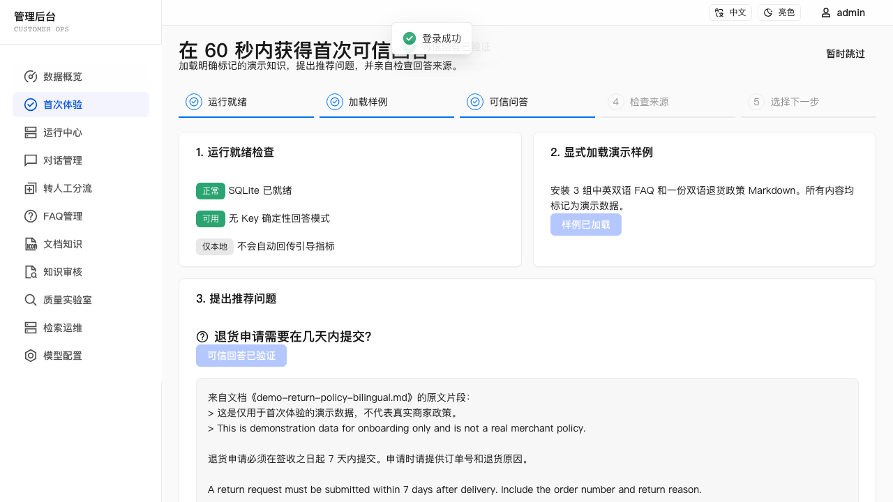
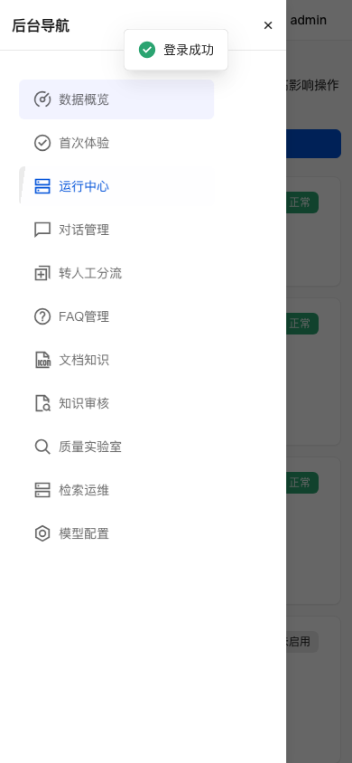

# v0.3.4 Release Evidence — First Value & Unified Operations

> Status: local release gates passed on `codex/v0.3.4-first-value-ops`.
> Publication identifiers are added after the pull request and merged-main
> gates complete.

## User scenario

1. Start a fresh database with `LLM_PROVIDER=other`, `EMBED_PROVIDER=other`,
   memory vectors, and no model or embedding key.
2. Log in as the deployment administrator and arrive at Getting Started.
3. Explicitly install `sample-pack-v1`.
4. Ask “退货申请需要在几天内提交？”.
5. Receive the document excerpt stating seven days, see
   `demo-return-policy-bilingual.md` in the sources, and mark the source
   reviewed.
6. Open Operations and distinguish healthy local operation from optional OCR
   or Qdrant that is not configured.

## Time to first value

The hard release gate measures the user-controlled slice from the rendered,
ready Getting Started page immediately before **Start** to the first visible
answer with sufficient grounding and the expected document source.

- `app-ready → first grounded answer`: **175 ms** on the final verification run.
- Required maximum: **60,000 ms**.
- Result: **passed**.

The environment-dependent clone metric was recorded separately and is not a
hard gate:

- Local source clone: **1 s**.
- `npm ci --prefer-offline`: **7 s** with a warm npm cache.
- Local clone start → completed Chromium first-value flow: **15 s**.
- Git source was local; no repository network transfer was involved. Package
  installation used the existing npm cache and available network conditions.

Verification environment:

- Apple arm64 MacBook Air, macOS 26.5 (build 25F71).
- Node.js 22.22.3; npm 11.12.1.
- Chromium through Playwright; memory vector store; no LLM/embedding API key.
- Metric run source: final v0.3.4 release-candidate worktree before checkpoint 3.

These numbers characterize one warm-cache development machine and are not a
deployment latency promise.

## Data and compatibility evidence

- Fresh versus legacy installation recognition and repeated-start migrations
  have focused tests.
- Historical sessions default to `customer`; onboarding sessions are excluded
  in repository-level analytics.
- Sample installation covers replay, retry-safe state, and document-grounded
  completion; deterministic UUIDv5 FAQ keys, transactional ownership, startup
  recovery, and document SHA reuse prevent duplicate FAQ and document rows.
- Chinese and English recommended questions both pass the no-key document
  grounding and expected-source contract.
- Forged or mismatched session/message evidence is rejected server-side.
- A verified answer and its bounded source snapshot are returned after reload,
  so a dismissed or refreshed guide cannot complete without showing evidence.
- `POST /api/chat` retains the existing SSE event set and makes
  `onboardingRunId` optional.
- Failed quality reruns require admin authorization and an idempotency key,
  accept only `failed` runs, and preserve the original datasets, policies,
  backend targets, and active-policy snapshot.

## Final verification

- `JWT_SECRET=test-secret-123 EMBED_PROVIDER=other npm test`: **passed**,
  including onboarding, operations, server regressions, and server/client
  TypeScript checks.
- FAQ evaluation: **11 cases**, Top-1 **100%**, Top-3 **100%**, no-match
  **100%**; source distribution `hybrid=9`, `vector=2`. The evaluation now owns
  its fixture instead of relying on production `db:seed` side effects.
- Document evaluation: **12 cases**, semantic and structure-baseline Top-3
  **100%**, MRR **0.958**. Mixed retrieval: **6/6 Top-1**.
- Quality evaluation: recall@1/3, MRR, and decision accuracy **100%**, with
  **0** unsafe answers and **0** over-refusals for both candidates.
- OCR evaluation: **6 cases**, average CER **1.33%**, block/page/table accuracy
  and low-quality detection **100%**. Triage: **10 cases**, category/priority/
  queue accuracy **100%**, no dangerous under-prioritization or security
  misroutes.
- OCR Worker: **11/11 unittest passed**; Python compile check passed for
  `app.py`, `request_contract.py`, and `contract_mapper.py`.
- `PLAYWRIGHT_CHANNEL=chromium npm run test:e2e`: **50/50 passed**, including
  the fresh no-key flow and 390px keyboard-closeable mobile Drawer.
- `EMBED_PROVIDER=other npm run build`: **passed**, 5,323 modules transformed.
- `git diff --check`: **passed**. Listener check found no project service on
  ports 3001, 5173, or 8001 after verification.
- Independent two-axis adversarial review initially found four gaps: crash-safe
  sample ownership, onboarding escalation isolation, evidence display after
  resume, and English no-key coverage. All four were fixed with regressions;
  both the standards reviewer and spec reviewer returned **PASS** on re-review.

Docker is not installed on the local verification host, so Compose parsing and
image builds were not rerun. v0.3.4 does not change Docker runtime files; the
documented no-key Docker onboarding path is covered by the same application
configuration and browser contract above.

## Known limits

- The Operations model card is configuration readiness, not a live paid
  provider health check.
- Optional Qdrant/OCR status depends on deployment configuration and existing
  bounded runtime status; Operations does not replace their owner workbenches.
- First-value demo content is not merchant policy and must be removed or
  replaced before a real deployment relies on it.
- Clone-to-first-answer varies with Git transport, npm cache, package network,
  browser availability, and machine resources; only the app-ready slice has a
  60-second release gate.
