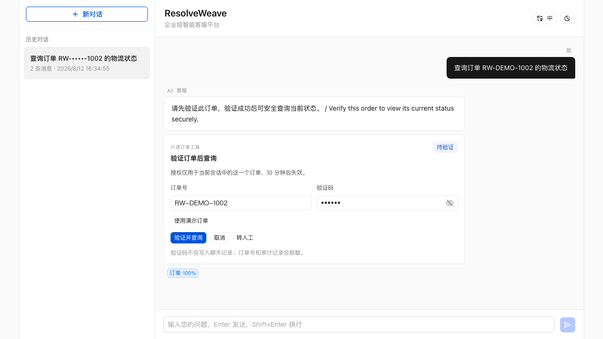
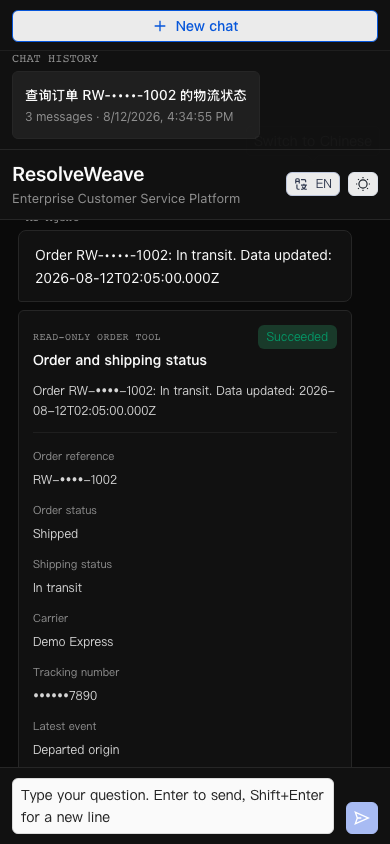

# v0.3.5 Release Evidence — Read-Only Customer Service Tools

> Status: release candidate on `codex/v0.3.5-read-only-order-tools`. Local
> release gates are recorded below. Merge, annotated tag, and GitHub Release
> remain pending explicit publication authorization and merged-main CI.

## User scenario

1. Start a development instance with the Demo Adapter and no model key.
2. Ask “查询订单 RW-DEMO-1002 的物流进度”.
3. Use the inline Demo values and choose “验证并查询”.
4. See the deterministic in-transit result, masked tracking number, latest
   event, dates, and refresh notice.
5. Switch to English, dark theme, and a 390 px viewport without losing the
   result layout.
6. Refresh history and see only the persisted safe summary.
7. Open the existing admin conversation detail and inspect the masked execution
   audit without seeing raw order, code, grant, or provider data.

## Security and data evidence

- Deterministic routing applies human > write action > private lookup > policy
  question before intent-model or retrieval work.
- Raw order references are replaced with masks before server-side chat
  persistence or downstream AI input. Verification code handling ends at the
  verification adapter call.
- Grants use random cookies, server-side token hashes, AES-256-GCM encrypted
  order references, HMAC fingerprints, a ten-minute expiry, and exact
  session/user/order/tool binding.
- Authorization is checked before duplicate-key enforcement. Order results are
  excluded from generic idempotency storage; same-key retries fail closed with
  `409`. New grants revoke old grants and closed sessions revoke active grants.
- A unique partial SQLite index limits each session to one `running` execution.
  The executor performs one adapter call with one bounded deadline.
- Strict result validation allows only closed order/shipping/carrier/event
  enums and bounded dates/masks. Invalid results produce no assistant result,
  retain only `unsafe_adapter_result`, and create one `order_support` handoff.
- Tool results never enter retrieval snapshots, Retrieval Trace, RAG prompts,
  or knowledge review.

## Tool evaluation

- Routing: **12/12** fixed Chinese/English and injection cases.
- Demo states: **4/4** (`processing`, `in_transit`, `delivered`, `exception`).
- Unauthorized lookup calls: **0**.
- Unsupported write-action lookup calls: **0**.
- Persistence leaks: **0** for raw order, verification code, grant token, and
  raw supplier markers.
- Timeout adapter calls: **1** with no automatic escalation.
- Unsafe result displays: **0**; `order_support` escalation: **1**.

## Final verification

- `EMBED_PROVIDER=other npm test`: **passed**, including onboarding,
  operations, order foundation/routing/service/API/UI, document/OCR, security,
  regression, and server/client TypeScript checks.
- FAQ evaluation: **11 cases**, Top-1/Top-3/no-match **100%**; document:
  **12 cases**, Top-3 **100%**, MRR **0.958**; mixed: **6/6 Top-1**.
- Quality evaluation: recall@1/3, MRR, and decision accuracy **100%** with
  **0** unsafe answers and **0** over-refusals for both candidates.
- OCR evaluation: **6 cases**, average CER **1.33%**, block/page/table and
  low-quality detection **100%**. Triage: **10 cases**, category/priority/queue
  **100%**, no dangerous under-prioritization or account-security misroutes.
- Tool evaluation: routing **12/12**, Demo states **4/4**, and every zero-call,
  zero-leak, zero-unsafe-display gate passed.
- OCR Worker: **11/11 unittest passed**; Python compile check passed for
  `app.py`, `request_contract.py`, and `contract_mapper.py`.
- `PLAYWRIGHT_CHANNEL=chromium npm run test:e2e`: **52/52 passed**, covering
  strict Cookie attributes, authorization and duplicate-key binding, safe history,
  customer desktop/mobile/theme/language states, and admin audit.
- `EMBED_PROVIDER=other npm run build`: **passed**, 5,324 modules transformed.
- `npm audit --omit=dev --registry=https://registry.npmjs.org`: **0
  vulnerabilities**. The configured npm mirror does not implement the audit
  endpoint, so the gate used the official registry explicitly.
- `git diff --check`: **passed**.

During the first complete run, the pre-RAG router exposed two compatibility
defects: knowledge sentences containing “申请退款” were treated as write actions,
and unconditional NFKC normalization changed a full-width FAQ question mark.
The router was narrowed to explicit write commands and now preserves byte-level
RAG text unless an order reference must be masked. The failing document, FAQ,
and knowledge-review cases passed before the full 52-test E2E rerun.

The independent standards/spec review then found four release-blocking gaps:
generic idempotency storage retained the transient lookup response, some
cancel/address commands could fall through to lookup, provider masks were too
permissive, and English failures displayed server-side Chinese text. The final
patch excludes lookup from generic replay, rejects duplicate keys with `409`,
widens deterministic write routing, validates mask shapes, localizes client
failures, reuses valid same-order grants, and adds deterministic Demo fault
fixtures. The complete regression, evaluation, E2E, build, audit, and diff gates
were rerun after these corrections.

## Known limits

- All included orders are fictional Demo fixtures. There is no production OMS,
  carrier, webhook, or polling integration.
- `userIdent` proves anonymous session ownership only. The ten-minute grant is
  not login, customer identity, or durable authorization.
- Full order results are intentionally not replayable after refresh and there
  is no customer order-history page.
- No recipient name, phone, address, payment information, carrier free text,
  provider code, or raw response can be returned through the normalized tool
  result.
- No refund, cancellation, return, address change, notification, or other write
  action exists. Human collaboration remains a structured read-only handoff.
- Verification limits are deployment-local. Multi-replica rate limiting and
  grant coordination require shared infrastructure in a later version.
