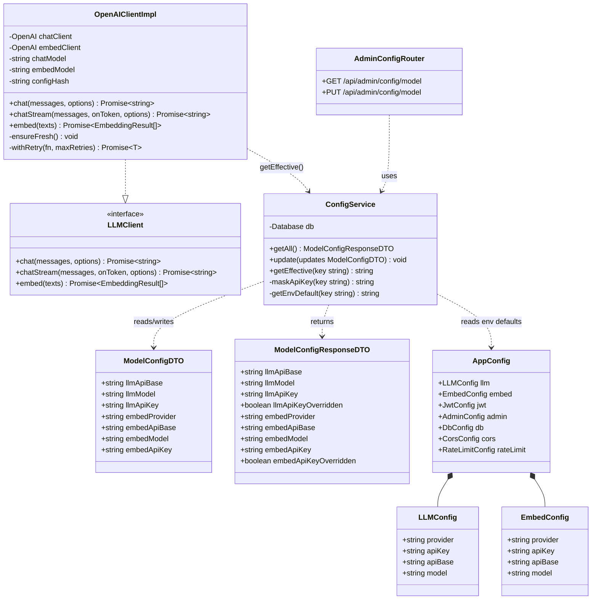
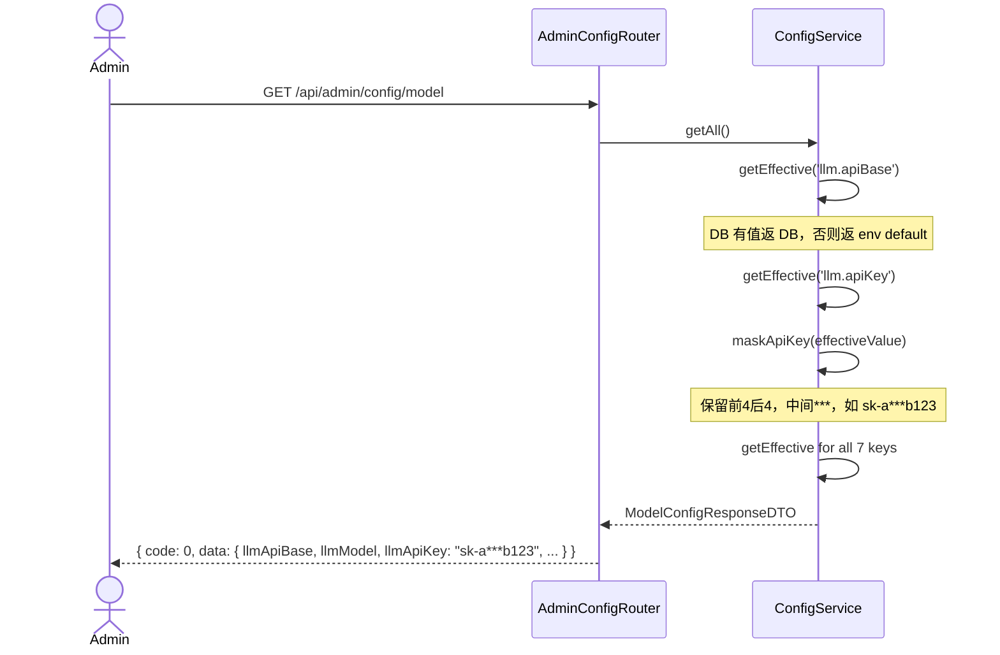
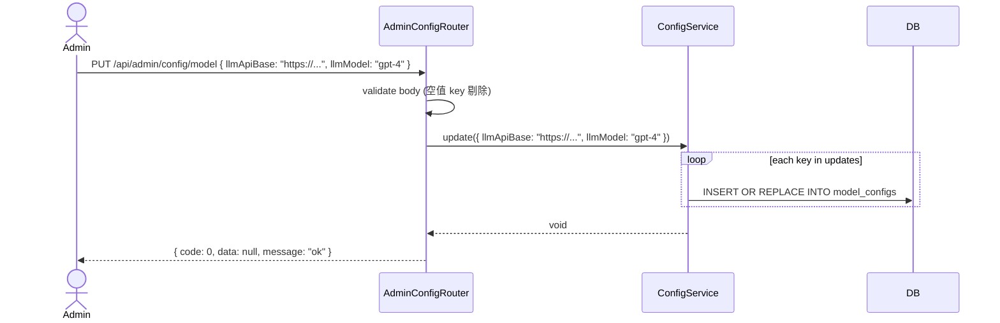
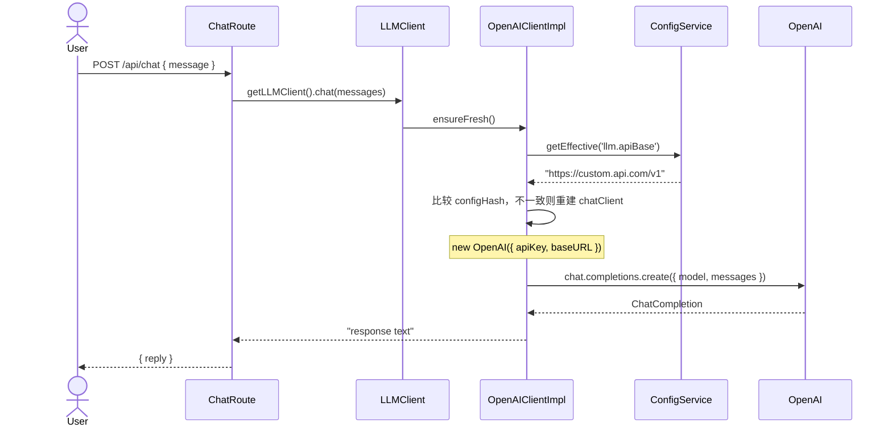
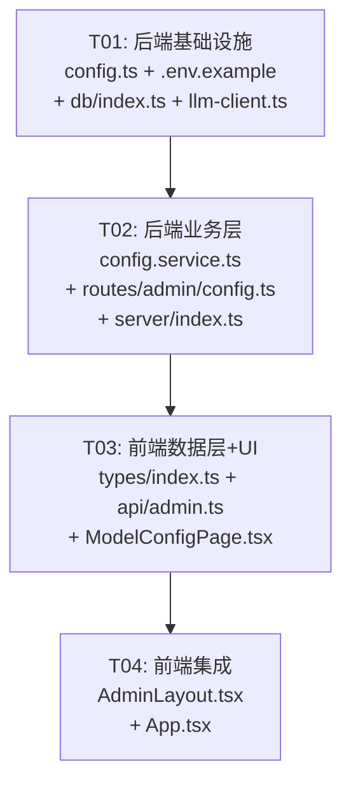

# 增量设计：LLM 配置用户自定义

> **项目**：smart-customer-service
> **增量类型**：功能增强 — LLM/Embed 配置支持 DB 动态覆盖
> **设计原则**：最小修改范围，向后兼容，env vars 作为默认值

---

## Part A：系统设计

### 1. Implementation Approach

#### 核心挑战

1. **现有 config 是 `as const` 静态对象**，启动时从 env 一次性读取，无法运行时动态变更
2. **LLM client 是单例**，构造时固化 client 实例；改配置后需要重建
3. **chat 和 embed 共用同一 OpenAI client**，需要拆分为独立 client
4. **Secret 字段（apiKey）需脱敏**展示在前端，PUT 时需要区分"未修改"与"清空"

#### 技术选型

| 决策点 | 选择 | 理由 |
|--------|------|------|
| 配置存储 | SQLite `model_configs` 表 | 复用现有 better-sqlite3，无需引入 Redis/etcd |
| 配置覆盖策略 | DB 优先，env 兜底 | 简单明确，空字符串 = 未设置 = fallback env |
| API Key 脱敏 | 保留前4后4，中间用 `***` | 标准做法，前端可据此判断是否被修改 |
| Client 重建策略 | `getLLMClient()` 内部检查 stale | 懒重建，避免每次请求都 new OpenAI |
| 前端状态管理 | 本地 useState | 配置页面简单，无需 Redux/Zustand |

#### 架构模式

```
┌─────────────────────────────────────────────────────┐
│                    env vars (.env)                    │
│  LLM_API_BASE, EMBED_PROVIDER, EMBED_API_KEY, ...   │
└─────────────────┬───────────────────────────────────┘
                  │ 默认值
┌─────────────────▼───────────────────────────────────┐
│                 ConfigService                        │
│  getEffective(key) → DB ?? env                      │
│  getAll() → { key: DB ?? env, masked apiKey }       │
│  update(partial) → 写入 DB (空值删除)                │
└─────────────────┬───────────────────────────────────┘
                  │
    ┌─────────────┼─────────────┐
    ▼             ▼             ▼
┌────────┐  ┌──────────┐  ┌──────────┐
│ config │  │ llm-client│  │ admin    │
│ .ts    │  │ .ts       │  │ config   │
│ (env)  │  │ (client)  │  │ route    │
└────────┘  └──────────┘  └──────────┘
```

---

### 2. File List

```
smart-customer-service/
├── .env.example                          # [修改] 新增 LLM_API_BASE, EMBED_* 变量
├── server/
│   ├── config.ts                         # [修改] env schema 扩展 + config.llm/embed 拆分
│   ├── index.ts                          # [修改] 新增 /api/admin/config 路由链
│   ├── db/
│   │   └── index.ts                      # [修改] initSchema 新增 model_configs DDL
│   ├── ai/
│   │   └── llm-client.ts                 # [修改] 独立 chat/embed client
│   ├── services/
│   │   └── config.service.ts             # [新建] 配置读写 + 脱敏 + effective 解析
│   └── routes/
│       └── admin/
│           └── config.ts                 # [新建] GET/PUT /api/admin/config/model
└── client/
    └── src/
        ├── App.tsx                       # [修改] lazy import + Route
        ├── types/
        │   └── index.ts                  # [修改] 新增 ModelConfigDTO
        ├── api/
        │   └── admin.ts                  # [修改] 新增 getModelConfig / updateModelConfig
        └── pages/
            └── admin/
                ├── AdminLayout.tsx        # [修改] 新增第4菜单项"模型配置"
                └── ModelConfigPage.tsx    # [新建] LLM + Embed 配置表单
```

---

### 3. Data Structures and Interfaces



---

### 4. Program Call Flow

#### 4.1 GET /api/admin/config/model — 获取配置（含脱敏）



#### 4.2 PUT /api/admin/config/model — 更新配置



#### 4.3 Chat / Embed 调用 — 配置生效



---

### 5. Anything UNCLEAR

| 问题 | 假设 |
|------|------|
| **apiKey 如何判断"未修改"** | 前端发送脱敏值（如 `sk-a***b123`）时后端识别为"未修改"，不做更新；发送明文时做更新 |
| **embed.provider 当前仅 OpenAI** | env schema 的 EMBED_PROVIDER 目前只支持 `'openai'`，未来可扩展 |
| **config 热生效范围** | `ensureFresh()` 仅在每次 `chat()`/`embed()` 调用时检查，不依赖定时器或文件监听 |
| **LLM_API_KEY 不再单独存在** | 原 `OPENAI_API_KEY` 保留向后兼容：`LLM_API_KEY` 优先，fallback 到 `OPENAI_API_KEY` |
| **多实例并发** | 单进程 Node.js，无分布式一致性问题，直接读写 SQLite 即可 |
| **model_configs 表不存在时的行为** | `initSchema` 自动创建，首次启动表为空，所有配置走 env default |

---

## Part B：任务分解

### 6. Required Packages

```
无新增第三方依赖。所有功能复用现有依赖：
- openai (已安装，用于 OpenAI client)
- better-sqlite3 (已安装，用于 model_configs 表)
- zod (已安装，用于请求体校验)
- tdesign-react (已安装，用于 ModelConfigPage UI)
```

### 7. Task List

---

#### T01：后端基础设施 — env 扩展 + DB 表 + AI 引擎适配

| 属性 | 值 |
|------|-----|
| **Task ID** | T01 |
| **Task Name** | 后端基础设施层 |
| **Source Files** | `server/config.ts`, `.env.example`, `server/db/index.ts`, `server/ai/llm-client.ts` |
| **Dependencies** | 无 |
| **Priority** | P0 |

**工作内容**：

1. **`.env.example`**：新增 `LLM_API_BASE`、`EMBED_PROVIDER`、`EMBED_API_BASE`、`EMBED_MODEL`、`EMBED_API_KEY` 字段
2. **`server/config.ts`**：
   - env schema 新增 5 个字段（含默认值）
   - `config.llm` 结构由 `{ provider, openaiApiKey, model, embedModel }` 拆为 `{ provider, apiKey, apiBase, model }`
   - 新增 `config.embed: { provider, apiKey, apiBase, model }`
   - `apiKey` 兼容逻辑：`LLM_API_KEY ?? OPENAI_API_KEY`；`EMBED_API_KEY` 空字符串 fallback 到 llm.apiKey
   - 移除 `as const`（ConfigService 需要动态读取）
3. **`server/db/index.ts`**：`initSchema()` 中新增 `model_configs` 表 DDL
4. **`server/ai/llm-client.ts`**：
   - 拆为两个独立 OpenAI client：`chatClient` + `embedClient`
   - `chatClient` 使用 `config.llm.*`创建
   - `embedClient` 使用 `config.embed.*`创建，`baseURL` 非空时传入
   - `embed.apiKey` 为空时 fallback `config.llm.apiKey`
   - 新增 `ensureFresh()` 方法：比较当前 config hash，变化时重建对应 client
   - `getLLMClient()` 单例模式保持不变

---

#### T02：后端业务层 — ConfigService + API 路由 + 路由注册

| 属性 | 值 |
|------|-----|
| **Task ID** | T02 |
| **Task Name** | 后端业务与 API 层 |
| **Source Files** | `server/services/config.service.ts`, `server/routes/admin/config.ts`, `server/index.ts` |
| **Dependencies** | T01 |
| **Priority** | P0 |

**工作内容**：

1. **`server/services/config.service.ts`**（新建）：
   - `ConfigService` 类，单例导出
   - `getAll()`：遍历 7 个 key，调用 `getEffective()`；apiKey 字段调用 `maskApiKey()` 脱敏
   - `update(updates: Partial<ModelConfigDTO>)`：遍历 updates，空值跳过、非空值 `INSERT OR REPLACE` 写入 `model_configs` 表
   - `getEffective(key: string)`：查 DB `model_configs` 表，有值返 DB 值，无值返 env default
   - `getEnvDefault(key: string)`：映射 key → `config.*` 字段值
   - `maskApiKey(key: string)`：长度 ≤ 8 全掩，否则保留前4后4，中间 `***`
2. **`server/routes/admin/config.ts`**（新建）：
   - `GET /model` → 调用 `configService.getAll()`，返回 `{ code: 0, data: ModelConfigResponseDTO }`
   - `PUT /model` → zod 校验 body（所有字段 optional），过滤空值，调用 `configService.update()`，返回 `{ code: 0, data: null }`
   - 挂载 `authMiddleware` + `adminOnlyMiddleware`
3. **`server/index.ts`**：
   - 新增变量 `let adminConfigRoutes: express.Router`
   - 新增懒加载路由链 `app.use('/api/admin/config', ...)`
   - 模式与现有 6 条路由链完全一致

---

#### T03：前端数据层 — 类型定义 + API 客户端 + ModelConfigPage

| 属性 | 值 |
|------|-----|
| **Task ID** | T03 |
| **Task Name** | 前端数据层与 UI 页面 |
| **Source Files** | `client/src/types/index.ts`, `client/src/api/admin.ts`, `client/src/pages/admin/ModelConfigPage.tsx` |
| **Dependencies** | T02 |
| **Priority** | P0 |

**工作内容**：

1. **`client/src/types/index.ts`**：新增 `ModelConfigDTO` 和 `ModelConfigResponseDTO` 类型定义
2. **`client/src/api/admin.ts`**：新增 `getModelConfig()` 和 `updateModelConfig(updates)` 两个 API 函数
3. **`client/src/pages/admin/ModelConfigPage.tsx`**（新建）：
   - 分两个卡片区块：**LLM 配置** 和 **EmbedModel 配置**
   - LLM 区字段：Provider（下拉，只读 `openai`）、API Base（文本输入）、Model（文本输入）、API Key（password 输入）
   - Embed 区字段：Provider（下拉，可选 `openai`/`other`）、API Base（文本输入）、Model（文本输入）、API Key（password 输入）
   - 页面加载时调用 `getModelConfig()` 获取脱敏后的当前值
   - 保存按钮 → 过滤空值字段 → `updateModelConfig()` → 成功后重新加载
   - API Key 字段特殊处理：脱敏展示时显示 placeholder 提示 `保持原值`；用户重新输入后发送明文
   - 使用 TDesign 的 `Form`、`Input`、`Select`、`Card`、`Button`、`Message` 组件
   - 与现有管理页面风格一致（白底卡片 + 24px padding）

---

#### T04：前端集成 — 菜单 + 路由

| 属性 | 值 |
|------|-----|
| **Task ID** | T04 |
| **Task Name** | 前端集成（菜单 + 路由） |
| **Source Files** | `client/src/pages/admin/AdminLayout.tsx`, `client/src/App.tsx` |
| **Dependencies** | T03 |
| **Priority** | P1 |

**工作内容**：

1. **`client/src/pages/admin/AdminLayout.tsx`**：
   - `MENU_ITEMS` 数组新增第 4 项：`{ path: '/admin/config', label: '模型配置', icon: <SettingIcon /> }`
   - `activePath` 逻辑新增 `/admin/config` 匹配
   - 从 `tdesign-icons-react` 引入 `SettingIcon`
2. **`client/src/App.tsx`**：
   - 新增 `const ModelConfigPage = lazy(() => import('./pages/admin/ModelConfigPage'))`
   - 在 `/admin` 的 `<Route>` 内新增 `<Route path="config" element={<ModelConfigPage />} />`

---

### 8. Shared Knowledge

```
- 所有 API 响应统一使用 { code: 0, data: T, message: 'ok' } 格式，code !== 0 表示错误
- 管理后台路由全部挂载 authMiddleware + adminOnlyMiddleware
- model_configs 表 key 命名规范：llm.apiBase, llm.model, llm.apiKey, embed.provider, embed.apiBase, embed.model, embed.apiKey
- env var 优先级：LLM_API_KEY > OPENAI_API_KEY（兼容旧版），其他字段直接对应
- apiKey 脱敏规则：len ≤ 8 → '********'；len > 8 → 前4 + '***' + 后4
- config 热生效：每次 LLM 调用时通过 ensureFresh() 比较 hash，变化时重建 client（无锁，单进程安全）
- 不动的文件（绝对不能改）：所有 server/ai/ 下的其他文件、所有 middleware、所有现有 route、所有现有 service
```

---

### 9. Task Dependency Graph


